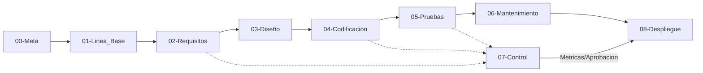

# Metaproceso 0 - Gobernanza del SGC (Vault)

> **Fundamentacion**: Segun Daniel Galin (2004), la infraestructura de SQA (procedimientos y plantillas) garantiza la consistencia. Este metaproceso define las reglas de operacion del Vault bajo el modelo **ETVX** adaptado a 8 procesos principales.

## 1. Estructura del Metaproceso (ETVX)

| Fase | Definicion | Detalles |
| :--- | :--- | :--- |
| **[E] Entry** | Criterios de Entrada | Acceso al Vault + [[01-Plan_Accion]] aprobado. |
| **[T] Tasks** | Tareas Operativas | Gestion de 9 carpetas, aplicacion de plantillas y trazabilidad REQ-DIS-COD-CP. |
| **[V] Verification** | Verificacion | Auditoria de cumplimiento normativo y revision de tags #estado. |
| **[X] Exit** | Criterios de Salida | Vault consistente y listo para auditoria final de 18-Entrega. |

## 2. Instrucciones de Operacion (Detalle Tecnico)

### Tarea 0.1: Gestion de Estructura y Auditoria de Jerarquia
1.  **Escorado Jerarquico**: No se permiten archivos fuera de las carpetas `00` a `09`. Cada carpeta debe tener exactamente un archivo `00-PROC-XX`.
2.  **Validacion de Prefijos**: Todo archivo nuevo debe ser nombrado siguiendo la tabla en [[03-Convenciones_y_Tags]].
3.  **Auditoria de Enlaces**: Ejecutar una revision semanal de "Enlaces Rotos" en Obsidian para asegurar que la trazabilidad REQ-DIS-COD-CP no se pierda.

### Tarea 0.2: Estandarizacion via Plantillas y YAML
1.  **Instanciacion**: Queda prohibido crear notas "en blanco". Se debe copiar el contenido de [[01-Proyecto/00-Meta/99-Plantillas_y_Checklists/TEMPLATE-REQ]] (si existe una plantilla), o crear la plantilla correspondiente si aun no existe.
2.  **Creacion de Plantillas Nuevas**: 
    *   Si un proceso requiere un nuevo tipo de artefacto, se debe crear un archivo en `00-Meta/99-Plantillas_y_Checklists` con el prefijo `TEMPLATE-`.
    *   La plantilla debe contener el Frontmatter YAML estandarizado (id, version, estado, responsable).
3.  **Integridad del Frontmatter**: Todo archivo debe tener los campos `id`, `version`, `estado` y `responsable` completados antes de pasar a #estado/verificado.

### Tarea 0.3: Control de Estados y Ciclo de Vida de la Nota
1.  **Estado/Borrador**: Notas en proceso de redaccion por el responsable.
2.  **Estado/Verificado**: Nota que ha pasado la checklist de su fase (ej. `CL-02`).
3.  **Congelacion de Linea Base**: Una vez aprobada, la nota debe subir su version (ej. 1.0 -> 1.1) ante cualquier cambio posterior, registrando el motivo en [[CR-00_Reporte_Cambios_Retroactivo]].

## 3. Ciclo de Vida del SGC (Flujo de Datos)

## 4. Matriz de Entradas y Salidas

| Entrada (Input) | Actividad (Activity) | Salida (Output) |
| :--- | :--- | :--- |
| [[03-Convenciones_y_Tags]] | Normalizacion del Vault | Vault estructurado (00-09) |
| [[02-Estandar_Estructura_Procesos]] | Aplicacion de rigor ETVX | Procesos `00-PROC-XX` |
| [[01-Proyecto/00-Meta/99-Plantillas_y_Checklists/TEMPLATE-REQ]] | Estandarizacion | Requerimientos (REQ) |

---
*Ultima actualizacion: 2026-05-13 | Axel Morales (Gobernanza)*
