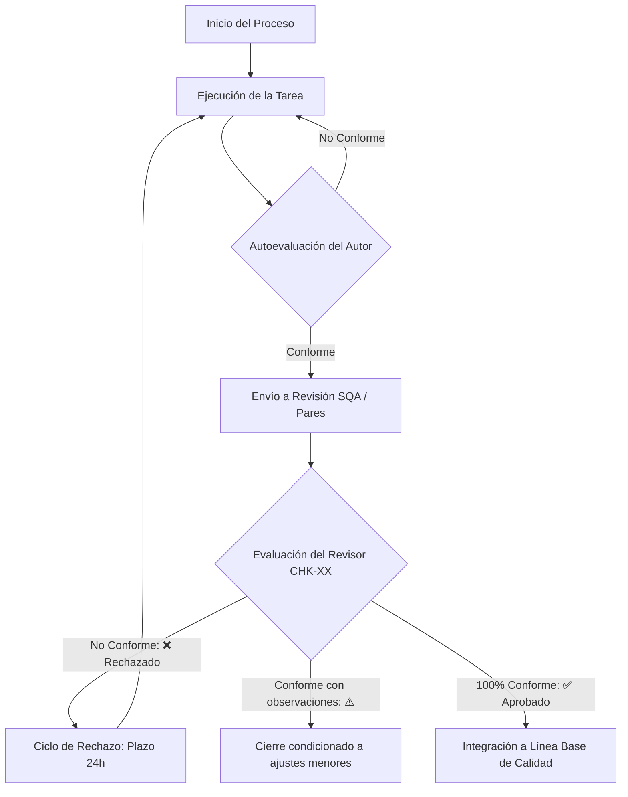

# Plan de Aseguramiento de la Calidad del Software (SQAP)
## XookTech — Sistema de Gestión de la Calidad (SGC)

---

## Historial de Revisiones

| Versión | Fecha | Autor | Revisor / Aprobador | Descripción de Cambios |
| :--- | :--- | :--- | :--- | :--- |
| **1.0** | 2026-05-25 | Analista de Control y Cambios | Líder Técnico / Product Owner | Creación del SQAP institucional bajo estándar IEEE 730-2014. |

---

## 1. Propósito y Alcance

### 1.1 Propósito
Este Plan de Aseguramiento de la Calidad del Software (SQAP, por sus siglas en inglés, *Software Quality Assurance Plan*) establece el marco de gobernanza, las actividades operacionales, las responsabilidades de calidad y los artefactos de verificación aplicables al ciclo de vida del desarrollo de software en **XookTech**. Este plan ha sido diseñado e implantado en conformidad estricta con el estándar internacional **IEEE Std 730-2014** (*IEEE Standard for Software Quality Assurance Processes*).

El SQAP sirve como el documento supremo de calidad del proyecto, asegurando que todos los productos de trabajo cumplan con los requisitos especificados, que los procesos definidos se ejecuten de manera disciplinada y que se mantenga una cultura de mejora continua basada en el ciclo PDCA (Planificar, Hacer, Verificar, Actuar).

### 1.2 Alcance
Este plan rige y aplica de manera obligatoria a los siguientes procesos técnicos del ciclo de vida del software definidos en el Sistema de Gestión de la Calidad (SGC) de XookTech:

| Código de Proceso | Proceso Técnico del Ciclo de Vida | Enlace a Documentación Base |
| :--- | :--- | :--- |
| **PROC-01** | Gestión y Especificación de Requisitos | [[02-Requisitos/00-REQ-Documentacion_Requisitos.md]] |
| **PROC-02** | Diseño de Arquitectura y Componentes | [[03-Diseño/00-DIS-Documentacion_Diseño.md]] |
| **PROC-03** | Codificación e Implementación de Software | [[06-Codigo/00-04-Documentacion_Codificacion.md]] |
| **PROC-04** | Verificación y Pruebas de Software | [[04-Pruebas/04-Documentacion_Pruebas.md]] |
| **PROC-05** | Transición y Despliegue en Producción | [[07-Despliegue/00-07-Documentacion_Despliegue.md]] |
| **PROC-06** | Soporte y Mantenimiento de Software | [[08-Mantenimiento/00-08-Documentacion_Mantenimiento.md]] |

### 1.3 Exclusiones
En cumplimiento con las directrices de alcance organizacional de XookTech, quedan explícitamente excluidos de este plan los siguientes procesos:
*   Procesos administrativos internos (nóminas, compras, recursos humanos).
*   Procesos contables y financieros de la corporación.
*   Procesos de ventas, prospección de clientes y marketing.
*   Cualquier infraestructura de red física o de soporte TI que no esté directamente vinculada a los entornos de servidores virtuales del producto.

---

## 2. Documentos de Referencia

Este plan se fundamenta y armoniza con una biblioteca de estándares internacionales de ingeniería de software (externos) y documentos de mejora del proyecto (internos) que no se duplican, sino que se integran como base operativa.

### 2.1 Estándares Externos

| ID de Referencia | Estándar Internacional | Uso Específico en este Plan |
| :--- | :--- | :--- |
| **[E-01]** | **IEEE Std 730-2014** | Define la estructura de las secciones, la gestión y las actividades de aseguramiento de calidad del software. |
| **[E-02]** | **ISO/IEC/IEEE 12207:2017** | Establece el modelo de referencia para los procesos del ciclo de vida del software. |
| **[E-03]** | **CMMI-DEV v2.0** | Proporciona el marco de referencia de madurez técnica, apuntando al Nivel 2 (Gestionado). |
| **[E-04]** | **IEEE Std 830-1998 / ISO/IEC/IEEE 29148:2018** | Rige la estructura y los criterios de calidad para la Especificación de Requisitos de Software (SRS). |
| **[E-05]** | **IEEE Std 1016-2009** | Define la organización lógica y las cuatro vistas obligatorias del Documento de Descripción de Diseño (SDD). |
| **[E-06]** | **IEEE Std 1028-2008** | Establece el protocolo formal para revisiones sistemáticas, inspecciones técnicas y auditorías de SQA. |
| **[E-07]** | **ISO/IEC 25010:2011** | Proporciona el modelo para evaluar las características de calidad del producto de software (mantenibilidad, seguridad). |
| **[E-08]** | **ISO/IEC 14764:2006** | Rige las actividades operativas de mantenimiento correctivo, evolutivo y adaptativo post-despliegue. |
| **[E-09]** | **SWEBOK v4 (2024)** | Guía del Cuerpo de Conocimiento de Ingeniería de Software utilizada como base conceptual. |

### 2.2 Documentos Internos

Los siguientes documentos internos del SGC de XookTech regulan de forma específica las prácticas operativas de cada fase y son referencias mandatorias de este plan:

| ID de Referencia | Proceso | Documento Técnico / Plan de Mejora | Enlace al Archivo en Obsidian |
| :--- | :--- | :--- | :--- |
| **[I-01]** | Requisitos | Plan de Mejora — Requisitos de Software | [[02-Requisitos/00-REQ-Plan_De_Mejora_Requisitos.md]] |
| **[I-02]** | Requisitos | Documentación — Gestión de Requisitos | [[02-Requisitos/00-REQ-Documentacion_Requisitos.md]] |
| **[I-03]** | Diseño | Plan de Mejora — Diseño de Software | [[03-Diseño/00-DIS-Plan_De_Mejora_Diseño.md]] |
| **[I-04]** | Diseño | Documentación — Ingeniería de Diseño | [[03-Diseño/00-DIS-Documentacion_Diseño.md]] |
| **[I-05]** | Codificación | Plan de Mejora — Codificación de Software | [[06-Codigo/00-04-Plan_De_Mejora_Codificacion.md]] |
| **[I-06]** | Codificación | Documentación — Estándares de Código | [[06-Codigo/00-04-Documentacion_Codificacion.md]] |
| **[I-07]** | Pruebas | Plan de Mejora — Pruebas de Software | [[04-Pruebas/04-Plan_De_Mejora_Pruebas.md]] |
| **[I-08]** | Pruebas | Documentación — Pruebas de Software | [[04-Pruebas/04-Documentacion_Pruebas.md]] |
| **[I-09]** | Revisiones | Plan de Mejora — Revisiones e Inspecciones | [[05-Revisiones_e_inspecciones/05-Plan_De_Mejora_Inspecciones.md]] |
| **[I-10]** | Revisiones | Documentación — Revisiones e Inspecciones | [[05-Revisiones_e_inspecciones/05-Documentacion_Inspecciones.md]] |
| **[I-11]** | Despliegue | Plan de Mejora — Despliegue en Producción | [[07-Despliegue/00-07-Plan_De_Mejora_Despliegue.md]] |
| **[I-12]** | Despliegue | Documentación — Gestión de Entornos | [[07-Despliegue/00-07-Documentacion_Despliegue.md]] |
| **[I-13]** | Mantenimiento | Plan de Mejora — Soporte y Mantenimiento | [[08-Mantenimiento/00-08-Plan_De_Mejora_Mantenimiento.md]] |
| **[I-14]** | Mantenimiento | Documentación — Soporte y Mantenimiento | [[08-Mantenimiento/00-08-Documentacion_Mantenimiento.md]] |

---

## 3. Gestión del SQAP

La correcta ejecución de las actividades de aseguramiento de calidad requiere una definición clara de responsabilidades y un marco de referencia de madurez de procesos.

### 3.1 Asignación de Roles por Persona

| Persona | Roles que desempeña | Conflicto de independencia |
|---|---|---|
| Persona 1 | Líder Técnico + Analista de Gobernanza | Ninguno (no codifica) |
| Persona 2 | Líder de Desarrollo + Analista de Pruebas | No puede revisar su propio código |
| Persona 3 | Analista de Requisitos + Revisor SQA | Revisión cruzada con Persona 2 |

### 3.1.1 Política de Independencia del Revisor

Dado el tamaño actual de XookTech (3 colaboradores), 
un mismo colaborador puede acumular múltiples roles. 
Sin embargo, se establece como restricción absoluta:

> Ningún colaborador puede actuar simultáneamente 
> como autor y revisor del mismo artefacto o 
> entregable de trabajo.

En escenarios de equipo reducido, se aplica el 
esquema de revisión cruzada: el autor de un artefacto 
es revisado por otro colaborador distinto. 
Cuando esto no sea posible por ausencia justificada, 
el Líder Técnico asume el rol de revisor y se 
documenta la excepción en el registro de auditoría.


### 3.2 Nivel de Madurez de Procesos
XookTech adopta el modelo **CMMI-DEV v2.0** como el marco estratégico de mejora, definiendo la siguiente ruta de madurez para todos sus procesos técnicos:

| Dimensión de Proceso | Estado Inicial (Nivel 1 - Inicial) | Estado Objetivo (Nivel 2 - Gestionado) |
| :--- | :--- | :--- |
| **Madurez de Procesos** | Informalidad operativa. Dependencia exclusiva del esfuerzo individual, sin control central. | Procesos técnicos caracterizados, disciplinados, planificados y repetibles bajo el modelo ETVX. |
| **Documentación** | Inexistente, desactualizada o fragmentada en canales informales (WhatsApp, notas verbales). | Repositorio formalizado y controlado en Obsidian, con plantillas estructuradas e inmutabilidad documental. |
| **Revisiones de Calidad** | Inexistentes o basadas en validaciones informales "a ojo" antes de liberar versiones. | Revisiones e inspecciones formales e independientes basadas en el estándar **IEEE Std 1028-2008**. |
| **Trazabilidad** | Incapacidad para rastrear el origen de una funcionalidad de código o el impacto de un cambio. | Trazabilidad bidireccional estricta (Requisito $\leftrightarrow$ Diseño $\leftrightarrow$ Código $\leftrightarrow$ Casos de Prueba) mediante la RTM. |

---

## 4. Documentación

El SGC de XookTech exige que cada proceso técnico genere evidencias y artefactos de calidad obligatorios. Esta sección detalla qué plantillas regulan su creación y con qué checklists se verifica su conformidad.

### 4.1 Artefactos por Proceso y Criterios de Validación

Todo artefacto del proyecto debe ser creado en conformidad con una plantilla estandarizada y auditado de forma independiente antes de ser incorporado a la Línea Base:

| Código | Proceso | Artefacto de Ingeniería | Plantilla de Creación (Formato / Registro) | Checklist de SQA / Instrumento |
| :--- | :--- | :--- | :--- | :--- |
| **PROC-01** | **Requisitos** | Especificación de Requisitos | `PLT-SRS.md` / `PLT-Historia-Usuario.md` | [[02-Requisitos/Checklists/CHK-SRS.md]] <br> [[02-Requisitos/Checklists/CHK-REQ.md]] |
| **PROC-01** | **Requisitos** | Matriz de Trazabilidad | Sección 6 de [[02-Requisitos/00-REQ-Plan_De_Mejora_Requisitos.md]] | [[02-Requisitos/Checklists/CHK-RTM.md]] |
| **PROC-02** | **Diseño** | Descripción de Diseño (SDD) | [[03-Diseño/Plantillas/Formatos/PLT-FOR_Plantilla_SDD.md]] | [[03-Diseño/Checklists/CHK-Verificacion_Diseño.md]] |
| **PROC-02** | **Diseño** | Decisiones Arquitectónicas | [[03-Diseño/Plantillas/Registros/PLT-REG_Decisiones_Arquitectura.md]] | [[05-Revisiones_e_inspecciones/Checklists/CHK-Verificacion_Inspecciones.md]] |
| **PROC-03** | **Codificación** | Código Fuente | [[06-Codigo/Plantillas/Formatos/PLT-FOR_Estandar_Codificacion.md]] | [[06-Codigo/Checklists/CHK-Verificacion_Codificacion.md]] |
| **PROC-04** | **Pruebas** | Plan de Pruebas | [[04-Pruebas/Plantillas/Formatos/PLT-FOR_Plan_Pruebas.md]] | [[04-Pruebas/Checklists/CHK-Verificacion_Pruebas.md]] |
| **PROC-04** | **Pruebas** | Casos de Prueba | [[04-Pruebas/Plantillas/Formatos/PLT-FOR_Caso_Prueba.md]] | [[04-Pruebas/Checklists/CHK-Verificacion_Pruebas.md]] |
| **PROC-04** | **Pruebas** | Registro de Ejecución | [[04-Pruebas/Plantillas/Registros/PLT-REG_Ejecucion_Pruebas.md]] | [[04-Pruebas/Checklists/CHK-Verificacion_Pruebas.md]] |
| **PROC-05** | **Despliegue** | Plan de Smoke Tests | [[07-Despliegue/Plantillas/Formatos/PLT-FOR_Plan_Smoke_Tests.md]] | [[07-Despliegue/Checklists/CHK-Verificacion_Despliegue.md]] |
| **PROC-05** | **Despliegue** | Registro de Servidores | [[07-Despliegue/Plantillas/Registros/PLT-REG_Entornos_Servidores.md]] | [[07-Despliegue/Checklists/CHK-Verificacion_Despliegue.md]] |
| **PROC-06** | **Mantenimiento** | Control de Cambios | [[08-Mantenimiento/Plantillas/Formatos/PLT-FOR_Cotizacion_Cambios.md]] | [[08-Mantenimiento/Checklists/CHK-Verificacion_Cambios.md]] |
| **PROC-06** | **Mantenimiento** | Bitácoras de Soporte | [[08-Mantenimiento/Plantillas/Registros/PLT-REG_Errores_Reportados.md]] <br> [[08-Mantenimiento/Plantillas/Registros/PLT-REG_Solicitudes_Mantenimiento.md]] | [[08-Mantenimiento/Checklists/CHK-Verificacion_Cambios.md]] |

### 4.2 Control de Versiones Documental
Todos los artefactos controlados y almacenados en el Sistema de Gestión de Calidad (Obsidian) deben incluir de manera obligatoria una sección inicial de metadatos estructurados que declare:
1.  **Versión del documento:** Expresado bajo nomenclatura estricta `X.Y` (Ej: 1.0 para primera liberación, 1.1 para ajustes menores, 2.0 para cambios mayores aprobados por el PO).
2.  **Fecha del cambio:** Formato internacional `AAAA-MM-DD`.
3.  **Autor intelectual:** Declarando el nombre y el rol específico dentro del proyecto.
4.  **Revisor / Aprobador:** Declarando el rol independiente que certificó el cierre.
5.  **Historial detallado de cambios:** Tabla secuencial que describa la justificación y detalles de cada cambio.

Cualquier documento en el SGC que carezca de este bloque de metadatos o que presente estados desactualizados será catalogado de inmediato como **No Conformidad documental menor**.

---

## 5. Estándares, Prácticas y Convenciones

Esta sección actúa como el catálogo mandatorio de las convenciones técnicas y de gobernanza operativa que rigen el trabajo cotidiano del equipo en XookTech.

### 5.1 Estándares de Codificación
La codificación de software en XookTech se rige estrictamente por lo establecido en el documento de estándares de codificación. Las tres directrices operativas inquebrantables son:
*   **Idioma de Programación:** Toda variable, nombre de función, comentario técnico e identificador de clase debe ser escrito estrictamente en **español** para eliminar ambigüedades idiomáticas.
*   **Nomenclatura (camelCase):** Se establece el estándar `camelCase` para variables, objetos y funciones (Ej: `calcularImpuestoAdicional()`), y `PascalCase` únicamente para nombres de clases.
*   **Bloque de Metadatos Obligatorio:** Todo archivo de código fuente (`.py`, `.js`, etc.) debe iniciar con un encabezado de metadatos obligatorio en comentarios que indique:
    ```javascript
    /**
     * @file: [Nombre_Archivo]
     * @descripcion: [Detalle conciso de la funcionalidad lúdica]
     * @autor: [Nombre y Rol]
     * @tarea: TAR-YYYY-NNN
     * @requisito: REQ-XXX
     * @fecha: AAAA-MM-DD
     */
    ```

### 5.2 Estándares para el Control de Versiones
El flujo de desarrollo en Git exige una gobernanza estricta para garantizar la estabilidad técnica y la trazabilidad de los cambios:
*   **Estrategia de Ramas:** Se prohíbe terminantemente la inyección directa de código sobre la rama `main`. Toda modificación o nueva funcionalidad debe ser desarrollada en una rama aislada con la nomenclatura `feature/TAR-YYYY-NNN` (o `bugfix/ERR-YYYY-NNN` para correcciones de mantenimiento).
*   **Integración Controlada (Pull Requests):** La integración de cualquier rama a `main` requiere la apertura obligatoria de una solicitud de Pull Request (PR) y la aprobación conforme de una Revisión por Pares utilizando la lista de verificación `CHK-Verificacion_Codificacion.md`.
*   **Estándar de Commits:** Cada mensaje de confirmación de cambios en el repositorio Git debe citar unívocamente el folio de la tarea o error asociado, utilizando el formato:
    `[TAR-YYYY-NNN]: descripción técnica concisa en español e imperativo`. (Ej: `[TAR-2026-004]: Implementa previsualización de color en el lienzo principal`).

### 5.3 Estructura de Folios y Trazabilidad Unificada
Para garantizar la auditoría e impedir brechas lógicas, el proyecto establece una estructura de folios alfanuméricos inmutables. Ninguna tarea, cambio o prueba técnica se ejecuta si no cuenta con su respectivo folio asignado:

| Tipo de Elemento | Nomenclatura del Folio | Ejemplo | Proceso Emisor |
| :--- | :--- | :--- | :--- |
| **Requisito Técnico** | `REQ-XXX` | `REQ-001` | Gestión de Requisitos (PROC-01) |
| **Tarea de Desarrollo** | `TAR-YYYY-NNN` | `TAR-2026-015` | Gestión de Proyectos / Desarrollo (PROC-03) |
| **Caso de Prueba** | `CP-XX` | `CP-02` | Verificación y Pruebas (PROC-04) |
| **Fallo Detectado** | `ERR-YYYY-NNN` | `ERR-2026-004` | Soporte y Mantenimiento (PROC-06) |
| **Solicitud de Mantenimiento** | `SOL-YYYY-NNN` | `SOL-2026-012` | Soporte y Mantenimiento (PROC-06) |
| **Solicitud de Cambio (CR)** | `CR-XXX` | `CR-002` | Gestión de la Configuración |

---

## 6. Revisiones y Auditorías

El aseguramiento de la calidad de software bajo IEEE 730 descansa sobre la ejecución de revisiones independientes, estructuradas y con consecuencias claras de reproceso.

### 6.1 Tipos de Revisión (Protocolo IEEE Std 1028-2008)

El SQA de XookTech define cuatro tipos de revisiones formales obligatorias a lo largo del ciclo de vida del software:



| Tipo de Revisión | Referencia Técnica | Momento de Ejecución | Instrumento Oficial (Checklist) |
| :--- | :--- | :--- | :--- |
| **Revisión de Requisitos** | IEEE 1028 §5 | Al finalizar la elicitación y estructuración técnica del requerimiento. | `CHK-SRS.md` <br> `CHK-REQ.md` |
| **Revisión de Trazabilidad RTM** | IEEE 730 §6.2 | Al cerrar los requisitos e integrar el diseño lógico. | `CHK-RTM.md` |
| **Inspección de Diseño (SDD)** | IEEE 1028 §6 | Al finalizar la redacción de la descripción de diseño arquitectónico. | `CHK-Verificacion_Diseño.md` |
| **Peer Review de Código** | IEEE 1028 §6 | Previo al merge de la rama de trabajo hacia `main`. | `CHK-Verificacion_Codificacion.md` |
| **Verificación de Pruebas** | IEEE 1028 | Previo a mostrar resultados al cliente. | `CHK-Verificacion_Pruebas.md` |
| **Verificación de Despliegue** | IEEE 730 §6 | Antes del pase a producción (Validación de Smoke Tests). | `CHK-Verificacion_Despliegue.md` |
| **Auditoría de Proceso** | IEEE 730 §6.3 | Trimestral (Liderada por el Revisor SQA independiente). | Lista de Auditoría Interna del SGC |

### 6.2 Criterios de Aprobación
El revisor independiente evaluará los artefactos y emitirá uno de los siguientes tres dictámenes formales:

*   **✅ Aprobado (Conformidad Completa):**
    *   **Criterio:** Cero (0) ítems evaluados como "No Cumple". Cumplimiento del 100% de los criterios obligatorios del checklist.
    *   **Consecuencia:** El artefacto se integra de inmediato a la Línea Base estable y se autoriza el inicio del siguiente proceso técnico.
*   **⚠️ Aprobado con Observaciones (Conformidad Condicionada):**
    *   **Criterio:** Entre uno (1) y tres (3) ítems menores marcados como "No Cumple" (detalles tipográficos, formateos o faltantes de referencias no críticas que no afecten el comportamiento lúdico).
    *   **Consecuencia:** Se permite avanzar con la siguiente fase, pero el Autor adquiere el compromiso escrito de subsanar los hallazgos en un plazo máximo de **48 horas**. SQA auditará el cierre en la siguiente revisión periódica.
*   **❌ Rechazado (No Conformidad Crítica):**
    *   **Criterio:** Cualquier ítem crítico calificado como "No Cumple" o más de tres (3) observaciones menores detectadas. (Ej: ausencia de escenarios BDD excepcionales, falta de diagramas en SDD, violación del estándar de nomenclatura).
    *   **Consecuencia:** Se congela el flujo de trabajo del artefacto y se activa el Ciclo de Rechazo.

### 6.3 Ciclo de Rechazo y Reproceso SQA
Para evitar que se arrastren defectos y garantizar la disciplina del equipo, el proceso establece un ciclo formal de reproceso con límites de tiempo estrictos:
1.  **Emisión del Rechazo:** Al detectar la no conformidad crítica, el Revisor SQA o revisor por pares marca el artefacto con un dictamen de **❌ Rechazado** e inyecta de forma obligatoria las observaciones técnicas en el Registro de Hallazgos (`PLT-REG_Hallazgos_Inspeccion.md`).
2.  **Notificación del Autor:** El autor original de la tarea es notificado de forma directa e inmediata sobre el estatus de rechazo técnico.
3.  **Corrección de Defectos:** El autor debe priorizar las observaciones recibidas y cuenta con un plazo máximo improrrogable de **24 horas** para corregir las desviaciones. Se prohíbe realizar modificaciones adicionales fuera del alcance de las observaciones.
4.  **Re-inspección Técnica:** Una vez aplicadas las correcciones, el autor notifica al Revisor SQA, quien ejecuta una segunda inspección exhaustiva utilizando la misma versión del checklist.
5.  **Escalación Técnica:** Si tras la segunda revisión persiste el dictamen de rechazo o existe desacuerdo técnico justificado entre el autor y el revisor, la controversia se escala formalmente ante el **Líder Técnico**, quien emitirá un dictamen definitivo de cumplimiento o una dispensa de calidad excepcional por escrito en las siguientes **12 horas**.

---

## 7. Gestión de Problemas y Acciones Correctivas

Toda desviación de calidad detectada en los procesos o productos de software debe ser registrada, clasificada y subsanada formalmente.

### 7.1 Clasificación de No Conformidades
Las no conformidades y fallos de calidad se clasifican en tres severidades que definen su prioridad técnica y sus tiempos de resolución obligatorios:

| Severidad de Calidad | Descripción del Incumplimiento | Tiempo Límite de Respuesta |
| :--- | :--- | :--- |
| **Crítica** | Desviaciones de funcionalidad crítica en producción (caída del sistema, pérdida de persistencia o datos, brechas de seguridad HTTPS/SSL expuestas). | **Inmediato** (Atención prioritaria 24/7 hasta la restauración estable). |
| **Mayor** | Incumplimientos técnicos graves de los planes de mejora o estándares del SQAP (código fuente integrado a `main` sin revisión por pares, inicio de desarrollo de un requerimiento sin aprobación digital del PO, diseño arquitectónico SDD omitido). | **Máximo 24 horas** hábiles para la inyección de la acción correctiva. |
| **Menor** | Errores menores de formateo, ausencia de metadatos en archivos de documentación no críticos, discrepancias tipográficas en Obsidian. | **Máximo 72 horas** hábiles para el cierre formal. |

### 7.2 Flujo de Registro y Cierre de Acciones Correctivas
Para garantizar el seguimiento, el Analista de Control y Cambios centralizará y registrará cada no conformidad identificada en el Registro de Hallazgos aplicando la siguiente estructura:
1.  **Asignación de Folio Único:** Se registra bajo un identificador estructurado `ERR-YYYY-NNN` (para fallas en software) o `HAL-YYYY-NNN` (para no conformidades de procesos).
2.  **Declaración del Proceso Afectado:** Identificación precisa del proceso (PROC-01 a PROC-06) donde se originó la desviación.
3.  **Descripción del Incumplimiento:** Detalle objetivo del criterio omitido del checklist o estándar.
4.  **Definición de la Acción Correctiva:** Tareas específicas que se deben ejecutar para subsanar el hallazgo e impedir su recurrencia.
5.  **Verificación de Cierre SQA:** El Revisor SQA independiente valida la efectividad de la corrección y firma electrónicamente el registro del cierre cambiando su estado de `#estado/abierto` a `#estado/cerrado`.

---

## 8. Herramientas y Tecnologías

El soporte operativo del SQAP se sustenta en una infraestructura tecnológica seleccionada por XookTech para automatizar e integrar los registros del SGC:

*   **Obsidian:**
    *   **Propósito dentro del SQA:** Actúa como el repositorio centralizado del Sistema de Gestión de Calidad (SGC). Resguarda el Vault institucional, los planes de mejora, las plantillas (`PLT-*`), listas de verificación completadas (`CHK-*`), minutas técnicas y el historial de Línea Base de Calidad.
*   **Git y GitHub:**
    *   **Propósito dentro del SQA:** Control de versiones del código fuente. Asegura la inmutabilidad de la línea base operativa, permite el aislamiento de cambios mediante ramas `feature/` y proporciona el lienzo de revisión interactiva (Pull Requests) para verificar el cumplimiento del checklist antes del acoplamiento a `main`.
*   **Linter y Analizadores Estáticos:**
    *   **Propósito dentro del SQA:** Utilizados de forma local por los desarrolladores para certificar el cumplimiento del estándar de codificación de forma rápida antes de abrir la solicitud de merge.
*   **Certbot y Nginx:**
    *   **Propósito dentro del SQA:** Herramientas de infraestructura de seguridad. Nginx se configura como proxy inverso industrial y Certbot gestiona la renovación automatizada de certificados TLS/SSL, asegurando el cifrado obligatorio HTTPS.
*   **Gunicorn bajo Systemd:**
    *   **Propósito dentro del SQA:** Servidor de aplicaciones industrial. Sustituye los servidores embebidos de desarrollo y se configura como servicio del sistema para garantizar la alta disponibilidad del software de manera automática en el VPS.

---

## 9. Control de Registros y Tablero de Calidad

El aseguramiento de calidad es una disciplina basada en datos empíricos y registros verificables.

### 9.1 Control de Registros de Calidad
Todos los registros de calidad (checklists completados, actas de inspección, reportes de smoke tests, registros de hallazgos) generados durante el ciclo de desarrollo deben almacenarse de forma inmutable en el repositorio de Obsidian, respetando los siguientes criterios de retención:

| ID de Registro | Nombre de Registro de Calidad | Frecuencia de Actualización | Tiempo Mínimo de Retención |
| :--- | :--- | :--- | :--- |
| **REG-01** | Registro de Verificación SQA — Requisitos | Por cada requisito congelado. | 3 años. |
| **REG-02** | Decisiones Técnicas y de Arquitectura | Por cada decisión crítica. | Ciclo de vida del producto. |
| **REG-03** | Tareas de Desarrollo y Peer Reviews | Por cada merge a `main`. | 1 año post-cierre de sprint. |
| **REG-04** | Registro de Ejecución de Pruebas | Por cada ciclo de pruebas. | 3 años. |
| **REG-05** | Informe de Inspecciones y Hallazgos SQA | Por cada inspección ejecutada. | 5 años (Auditable). |
| **REG-06** | Incidentes, Errores y Solicitudes de Soporte | Mensual. | Ciclo de vida del producto. |

### 9.2 Tablero de Calidad (Métricas Consolidadas)
El **Tablero de Calidad** consolida los indicadores de éxito definidos en los distintos planes de mejora de XookTech. El **Analista de Control y Cambios** actualiza este tablero mensualmente y lo reporta formalmente en la revisión técnica trimestral liderada por el **Líder Técnico**:

| Indicador de Calidad | Proceso Asociado | Fórmula de Cálculo / Criterio | Meta Establecida | Frecuencia de Medición |
| :--- | :--- | :--- | :--- | :--- |
| **Trazabilidad de Requisitos (RTM)** | Gestión de Requisitos (PROC-01) | $\frac{\text{REQ aprobados trazados a diseño y pruebas}}{\text{Total de REQ aprobados en línea base}} \times 100$ | **100.00%** (Cero tolerancia a brechas) | Por ciclo de congelamiento |
| **Trazabilidad de Tareas** | Codificación y Diseño (PROC-03) | $\frac{\text{Tareas con requisito escrito de origen}}{\text{Total de tareas ejecutadas en desarrollo}} \times 100$ | $\ge \mathbf{95.00\%}$ | Por cierre de sprint |
| **Peer Reviews Aprobados** | Codificación (PROC-03) | $\frac{\text{Ramas integradas a main con revisión por pares aprobada}}{\text{Total de ramas integradas en el repositorio}} \times 100$ | **100.00%** (Puerta de control obligatoria) | Por cada pull request |
| **Despliegues Exitosos** | Despliegue en Producción (PROC-05) | $\frac{\text{Liberaciones sin activación de plan de rollback}}{\text{Total de liberaciones realizadas en el periodo}} \times 100$ | $\ge \mathbf{95.00\%}$ | Por liberación (Release) |
| **Incidentes con Folio** | Soporte y Mantenimiento (PROC-06) | $\frac{\text{Fallos reportados con registro en bitácora y folio de soporte}}{\text{Total de fallos de soporte recibidos por cualquier canal}} \times 100$ | $\ge \mathbf{95.00\%}$ | Mensual |

---

## 10. Capacitación y Entrenamiento

Para garantizar que el SQAP no sea un documento inerte, sino una práctica operativa viva en la organización, se establece un **Plan de Inducción y Entrenamiento de Calidad** obligatorio para todo el personal técnico de XookTech (ingenieros internos, consultores externos y programadores de nuevo ingreso).

### 10.1 Programa de Inducción Técnica al SGC
Todo nuevo integrante del equipo técnico debe agendar e iniciar su curso de inducción de calidad en su primera semana laboral, cubriendo los siguientes módulos prácticos guiados por el Analista de Control y Cambios:

1.  **Introducción al SGC de XookTech:** Filosofía de calidad CMMI Nivel 2, importancia de la inmutabilidad documental, estructura física y organización del Vault corporativo en Obsidian.
2.  **Ingeniería de Requisitos bajo formato BDD:** Capacitación práctica en el modelado de escenarios lógicos utilizando la notación estructurada `Dado / Cuando / Entonces`. Técnicas para redactar cotas, límites numéricos y excepciones lógicas para eliminar la ambigüedad técnica.
3.  **Diseño Arquitectónico bajo IEEE 1016 y Mermaid.js:** Comprensión de las cuatro vistas arquitectónicas obligatorias (descomposición, comportamiento, datos e interfaz) y entrenamiento en el renderizado y modelado de diagramas fluidos mediante Mermaid.js.
4.  **Estándares de Codificación y Control de Versiones:** Entrenamiento en el respeto a las reglas del estándar (camelCase, idioma español, comentarios obligatorios de metadatos), uso de Git bajo la estrategia de ramas de características y estructura de mensajes de commits descriptivos vinculados a folios.
5.  **Verificación, Pruebas e Inspecciones IEEE 1028:** Comprensión del rol independiente de SQA, autoevaluación técnica y uso correcto de los checklists y registros de hallazgos del SGC.

### 10.2 Evaluación y Certificación Operativa
Al finalizar el programa de entrenamiento, el participante resolverá una prueba práctica y simulará la ejecución de un ciclo ETVX completo (desde la especificación BDD de una característica ficticia hasta su verificación de código en un repositorio de sandbox). 

La obtención de la **Certificación de Calidad Interna de XookTech** firmada digitalmente por el Revisor SQA es un **criterio de salida obligatorio** para que cualquier nuevo ingeniero reciba accesos de inyección sobre las ramas de desarrollo reales y carpetas aprobadas del SGC.


