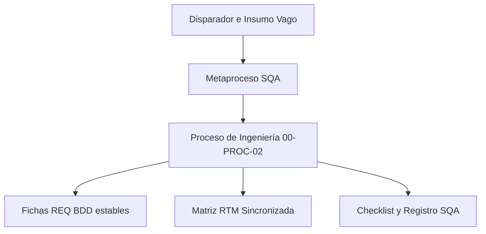

# Plan de Metaproceso y Causalidad SQA — Fase de Requisitos

**Código de Registro:** MET-02-01  
**Responsable de Redacción:** Analista de Gobernanza y Diseño  
**Fecha de Elaboración:** 24 de Mayo de 2026  
**Entradas:** Prácticas empíricas iniciales, minutas de alineación, solicitudes originales del Product Owner y normas SQA.  
**Salidas:** Modelo del metaproceso de requisitos, estructura unificada de 4 componentes para PROC-02, simulación del ciclo de vida de REQ-01 y auditoría correctiva SQA de REQ-07.  
**Propósito:** Detallar, justificar y simular de forma integral el metaproceso de reingeniería aplicada sobre la Fase 02 - Requisitos, evidenciando científicamente cómo la triada Actualmente/Nota/Propuesta detona la transición formal de solicitudes vagas a artefactos BDD estables bajo control de configuración SQA.

---

## 1. El Metaproceso de Requisitos: Justificación y Causalidad SQA

El **Metaproceso de Requisitos** es el estándar de reingeniería que rige el diseño de la Fase 02 del SGC. Su propósito es transparentar cómo las necesidades empíricas del proyecto *Visualizador de Marcos* son capturadas, analizándolas a través de la literatura académica e integrándolas en un proceso de ingeniería de software disciplinado, seguible y verificable por el Aseguramiento de Calidad o SQA.

El metaproceso actúa como el puente lógico entre el insumo inicial y el proceso final:

Para asegurar que cada paso del proceso sea completamente ejecutable y metodológico, las actividades de la **Especificación de Requisitos 00-PROC-02** se modelan bajo la estructura unificada de **4 componentes**, separando de manera explícita y visible el diagnóstico actual, el soporte académico y la propuesta definitiva:

---

### Actividad 1: Capturar la solicitud de requisito

#### A. Disparador
*   **Disparador:** El cliente o Product Owner tiene una nueva idea o necesidad y la comunica de forma verbal o escrita de manera informal.
*   **Insumo de Entrada:** Solicitud empírica de funcionalidad o mensaje informal.

#### B. Actualmente
1.  **Paso 1 o Recepción informal:** El Product Owner envía un mensaje de texto corto por WhatsApp o realiza una llamada de voz rápida detallando una idea general de negocio.
2.  **Paso 2 o Ausencia de registro:** El mensaje recibido se queda en la bandeja de chats personales sin registrarse en ningún documento oficial, carpeta o asignación de folio estructurado.
3.  **Paso 3 o Descontrol de alcance:** El desarrollador del equipo comienza a codificar directamente basándose únicamente en su interpretación preliminar del chat, sin un análisis formal de impacto de tiempo, costos o arquitectura.

#### C. Nota Técnica
De acuerdo con CMMI-DEV v1.3 y **Regan 2002**, la captura informal de requisitos es la principal causa de desvíos en el alcance. Centralizar e identificar de forma única cada petición en una nota física de entrada previene la pérdida de control y formaliza la entrada técnica de requisitos.

#### D. Sugerencia
El detalle procedimental y la agenda operativa completa se definen en el documento de proceso ejecutable 00-PROC-02:
1.  **Paso 1 o Registro centralizado:** El Analista de Requerimientos toma la solicitud informal y crea un archivo nota física en la carpeta de pendientes.
2.  **Paso 2 o Identificación de origen:** Asigna un ID consecutivo estructurado y asocia el enlace con su solicitud de cambio relacionada.
3.  **Paso 3 o Congelamiento inicial:** Registra el estado inicial de la ficha como Pendiente y la archiva en la carpeta física de pendientes de requisitos.

---

### Actividad 2: Especificar y estructurar el requisito

#### A. Disparador
*   **Disparador:** La ficha básica inicial REQ-XXX registrada en estado Pendiente en la carpeta física de pendientes.
*   **Insumo de Entrada:** Ficha básica inicial REQ-XXX.md.

#### B. Actualmente
1.  **Paso 1 o Redacción informal:** Se redacta un párrafo corto y ambiguo en lenguaje natural en el cuerpo de la nota describing la función.
2.  **Paso 2 o Ausencia de cotas:** No se establecen límites concretos de formato, tamaño o rendimiento.
3.  **Paso 3 o Ambigüedad técnica:** El desarrollador decide de manera arbitraria las reglas en el backend, imposibilitando que el tester diseñe casos de prueba medibles y objetivos.

#### C. Nota Técnica
El **SWEBOK v4** y **William E. Lewis 2009** exigen que los requisitos de software sean verificables, medibles y libres de ambigüedad. La adopción de escenarios de aceptación estructurados en formato **BDD o Dado/Cuando/Entonces** y cotas numéricas claras provee las bases necesarias para el diseño de casos de prueba robustos.

#### D. Sugerencia
El detalle procedimental y la agenda operativa completa se definen en el documento de proceso ejecutable 00-PROC-02:
1.  **Paso 1 o Aplicar plantilla:** El Analista de Requerimientos edita el requerimiento y aplica la plantilla formal de especificación.
2.  **Paso 2 o Definir reglas de negocio:** Especifica las reglas de negocio técnicas limitantes como formatos permitidos, peso máximo de archivos y límites de rendimiento.
3.  **Paso 3 o Estructurar escenarios BDD:** Desarrolla y redacta los escenarios de aceptación bajo la estructura de Dado/Cuando/Entonces.

---

### Actividad 3: Validar y aprobar el requisito con el Product Owner

#### A. Disparador
*   **Disparador:** Conclusión de la especificación técnica en formato BDD para REQ-XXX.md lista para revisión.
*   **Insumo de Entrada:** Ficha especificada técnicamente REQ-XXX.md sin firma.

#### B. Actualmente
1.  **Paso 1 o Asunción interna:** El equipo lee el requerimiento redactado y asume de forma interna que cumple con lo que el cliente desea.
2.  **Paso 2 o Programación directa:** Se inicia la codificación de la funcionalidad sin presentar la especificación técnica detallada al PO para su revisión formal.
3.  **Paso 3 o Rechazo de entrega:** Durante la demostración final, el cliente rechaza la funcionalidad al constatar que el comportamiento real difiere de lo que él deseaba de palabra.

#### C. Nota Técnica
**Daniel Galin 2004** conceptualiza la aprobación del cliente como un contrato técnico. **Regan 2002** sustenta que la confirmación escrita explícita en la sección Evidencia de Aprobación es la única evidencia objetiva que deslinda la responsabilidad de SQA ante discrepancias de alcance.

#### D. Sugerencia
El detalle procedimental y la agenda operativa completa se definen en el documento de proceso ejecutable 00-PROC-02:
1.  **Paso 1 o Presentación de la ficha:** El Analista de Requerimientos expone la ficha de requerimiento BDD al Product Owner.
2.  **Paso 2 o Resolución de dudas:** Resuelven discrepancias y ajustan los escenarios de aceptación de mutuo acuerdo.
3.  **Paso 3 o Inyección de aprobación:** Inserta la confirmación formal por escrito en la sección de Evidencia de Aprobación y cambia el estado formal a Aprobado.

---

### Actividad 4: Línea Base de Requisitos y Trazabilidad SQA

#### A. Disparador
*   **Disparador:** Ficha de requerimiento REQ-XXX con estado Aprobado y firma de aprobación inyectada.
*   **Insumo de Entrada:** Ficha firmada REQ-XXX.md.

#### B. Actualmente
1.  **Paso 1 o Mezcla de archivos:** Las notas aprobadas y pendientes se mantienen en la misma carpeta física común sin segregación.
2.  **Paso 2 o Falta de control:** El desarrollador programa tomando notas de forma desordenada, sin saber qué está aprobado establemente y qué está pendiente de cambios.
3.  **Paso 3 o Desconexión de pruebas:** No se realiza un mapeo formal hacia los casos de diseño de la Fase 03 ni a los casos de prueba de la Fase 05, perdiéndose la trazabilidad en el ciclo de vida.

#### C. Nota Técnica
CMMI-DEV v1.3 y **William E. Lewis 2009** exigen el control de configuración físico para proteger la Línea Base estable. SQA requiere trazabilidad bidireccional desde el requerimiento hasta el código y los casos de prueba para garantizar la cobertura del 100% y facilitar el análisis de impacto.

#### D. Sugerencia
El detalle procedimental y la agenda operativa completa se definen en el documento de proceso ejecutable 00-PROC-02:
1.  **Paso 1 o Segregación física:** Mueve físicamente la ficha de requerimiento aprobada a la carpeta de aprobados oficiales.
2.  **Paso 2 o Actualización de trazabilidad RTM:** El analista mapea las relaciones de trazabilidad bidireccional actualizando la Matriz RTM.
3.  **Paso 3 o Auditoría SQA:** El Analista de Control y Cambios evalúa la ficha con el checklist CL-02 y emite el dictamen de calidad en el registro REG-02-01.

---

## Referencias

[1] SWEBOK v4.0. _Guía al Cuerpo de Conocimiento de la Ingeniería de Software_, IEEE Computer Society, 2024. Capítulo: Requisitos de Software.

[2] Regan, G. O. (2002). _A Practical Approach to Software Quality_. USA: Springer. (Estructuración de Requisitos e Independencia).

[3] Galin, D. (2004). _Software Quality Assurance: From theory to implementation_. Pearson / Addison-Wesley. (Calidad Contractual e Infraestructura).

[4] CMMI-DEV v1.3. _CMMI para Desarrollo_, Software Engineering Institute. Áreas de proceso: Gestión de Requisitos (REQM) y Gestión de Configuración (CM).
