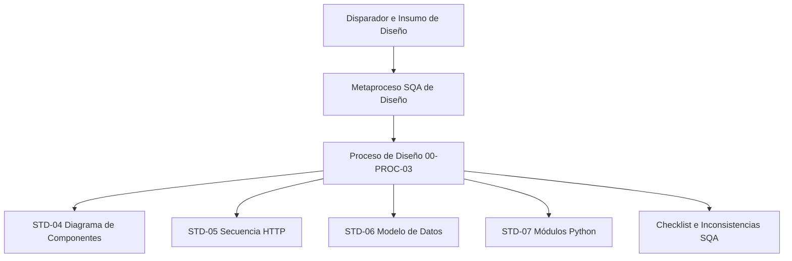

# Plan de Metaproceso y Causalidad SQA — Fase de Diseño

**Código de Registro:** MET-03-01  
**Responsable de Redacción:** Analista de Gobernanza y Diseño  
**Fecha de Elaboración:** 24 de Mayo de 2026  
**Entradas:** Requisitos del Sistema, Lógica Empírica, Prácticas Heredadas y Especificaciones Iniciales  
**Salidas:** Modelo del metaproceso de diseño, estructura unificada de 4 componentes para PROC-03, e inspección de paridad de arquitectura  
**Propósito:** Detallar, justificar y simular de forma integral el metaproceso de reingeniería aplicada sobre la Fase 03 - Diseño, evidenciando científicamente cómo la triada Actualmente/Nota/Propuesta detona la transición formal de diagramas informales a artefactos de diseño estructurados y estables bajo el control de configuración SQA.

---

## 1. El Metaproceso de Diseño: Justificación y Causalidad SQA

El **Metaproceso de Diseño** es el estándar de reingeniería que rige el diseño de la Fase 03 del SGC. Su propósito es transparentar cómo las necesidades técnicas del proyecto *Visualizador de Marcos* son mapeadas, analizándolas a través de la literatura académica e integrándolas en un proceso de diseño de software disciplinado, seguible y verificable por el Aseguramiento de Calidad o SQA.

El metaproceso actúa como el puente lógico entre el insumo de entrada y el proceso final:

Para asegurar que cada paso del proceso sea completamente ejecutable y metodológico, las actividades del **Proceso de Diseño del Sistema 00-PROC-03** se modelan bajo la estructura unificada de **4 componentes**, separando de manera explícita y visible el diagnóstico actual, el soporte académico y la propuesta definitiva:

---

### Actividad 1: Mapear y modelar la arquitectura de componentes

#### A. Disparador
*   **Disparador:** La especificación formal de requisitos aprobados inyectados en la Línea Base de la fase de requisitos.
*   **Insumo de Entrada:** Fichas de requisitos de la carpeta `02-Requisitos/01-Ingenieria_Requisitos/01-Aprobados/` y el Repositorio de Código Fuente oficial ([Marcos2 GitHub](https://github.com/Bigsami89/Marcos2)).

#### B. Actualmente
1.  **Paso 1 o Ausencia de diagramas:** Los desarrolladores no cuentan con diagramas de arquitectura lógica o física de componentes, decidiendo de manera informal y sobre la marcha qué módulos y carpetas crear.
2.  **Paso 2 o Cero análisis de dependencias:** No se evalúa el acoplamiento ni la compatibilidad de librerías en sistemas heredados, provocando colisiones entre versiones durante el arranque del prototipo.
3.  **Paso 3 o Inestabilidad técnica:** El sistema carece de interfaces definidas y modulares, forzando la creación de código monolítico y difícil de mantener.

#### C. Nota Técnica
El diseño de la arquitectura física y de componentes es el cimiento de la mantenibilidad en ingeniería de software. Según **SWEBOK v4** (Diseño de Software), mapear de forma ordenada los componentes lógicos e interfaces previene el sobre-acoplamiento. **Daniel Galin 2004** destaca que el aseguramiento de la calidad requiere la definición formal previa de la infraestructura para mitigar errores de integración. Se propone modelar y mapear físicamente los componentes en una vista estructurada.

#### D. Sugerencia
El detalle procedimental y la agenda operativa completa se definen en el documento de proceso ejecutable 00-PROC-03:
1.  **Paso 1 o Inspección física:** El Analista de Gobernanza y Diseño clona o verifica el repositorio local ([Marcos2 GitHub](https://github.com/Bigsami89/Marcos2)) y mapea su estructura de carpetas física y el archivo `requirements.txt` en la raíz para identificar dependencias y módulos de negocio.
2.  **Paso 2 o Estructuración del Diagrama:** Construye y modela el diagrama de bloques estructurado bajo el estándar STD-04, segregando Cliente, Servidor Flask, OpenCV y Pillow.
3.  **Paso 3 o Congelamiento de Arquitectura:** Entrega el diagrama al Analista de Control y Cambios para su registro formal en la Línea Base de Diseño.

---

### Actividad 2: Modelar el flujo de datos y ciclo de vida de peticiones

#### A. Disparador
*   **Disparador:** Los diagramas de componentes arquitectónicos STD-04 validados y disponibles en la carpeta de ingeniería.
*   **Insumo de Entrada:** Documento técnico STD-04.

#### B. Actualmente
1.  **Paso 1 o Cero documentación dinámica:** No se mapea el ciclo de peticiones HTTP ni la secuencia que siguen los datos al transitar por el frontend, backend y base de datos.
2.  **Paso 2 o Desconocimiento de secuencias:** Los desarrolladores no comprenden en qué orden se procesan las imágenes o cómo responde el backend ante llamadas asíncronas, programando asunciones empíricas.
3.  **Paso 3 o Cuellos de botella:** Se generan bloqueos de procesamiento y demoras severas en el renderizado de imágenes de alta resolución debido a la falta de optimización del flujo.

#### C. Nota Técnica
El modelado dinámico (ciclo de vida de peticiones y diagramas de secuencia) es indispensable para el análisis del rendimiento y la verificación del flujo de datos en el sistema. Conforme a **William E. Lewis 2009**, la especificación gráfica de interacciones dinámicas es un mecanismo crítico para la detección temprana de defectos lógicos y cuellos de botella antes de iniciar la programación detallada. Se propone modelar los flujos dinámicos mediante notación Mermaid.js.

#### D. Sugerencia
El detalle procedimental y la agenda operativa completa se definen en el documento de proceso ejecutable 00-PROC-03:
1.  **Paso 1 o Identificación de endpoints:** El Analista de Gobernanza y Diseño rastrea los endpoints del servidor Flask en el código para modelar su ciclo de vida.
2.  **Paso 2 o Diseño del Flujo:** Modela y documenta el flujo dinámico HTTP de secuencia en el estándar STD-05 mediante diagramas Mermaid interactivos.
3.  **Paso 3 o Inyección de Trazabilidad:** Mapea las relaciones entre el endpoint del servidor y el requisito de negocio de entrada correspondiente.

---

### Actividad 3: Reconstruir y modelar el esquema de datos del sistema

#### A. Disparador
*   **Disparador:** La necesidad técnica de representar con precisión matemática las variables de catálogo en el motor de marcos.
*   **Insumo de Entrada:** Catálogos de marcos en memoria o archivos JSON y base de datos SQLite.

#### B. Actualmente
1.  **Paso 1 o Definición ad-hoc de variables:** Los atributos de los marcos y las equivalencias píxel-centímetro se definen en variables volátiles en memoria sin documentación.
2.  **Paso 2 o Falta de consistencia de tipos:** No se asignan tipos de datos estrictos ni validaciones de redondeo, causando cálculos fallidos y distorsión al redimensionar texturas.
3.  **Paso 3 o Subjetividad semántica:** Diferentes desarrolladores usan diferentes interpretaciones numéricas para las mismas constantes físicas del catálogo.

#### C. Nota Técnica
Una especificación rigurosa de las estructuras de datos es una medida preventiva esencial contra fallos de redondeo y renderizado gráfico. **Daniel Galin 2004** sustenta que documentar formalmente las variables y sus descripciones semánticas elimina la subjetividad, garantizando la paridad del software. Se propone reconstruir el modelo de datos formal, detallando tipos, nombres reales y las ecuaciones matemáticas de equivalencia de margen.

#### D. Sugerencia
El detalle procedimental y la agenda operativa completa se definen en el documento de proceso ejecutable 00-PROC-03:
1.  **Paso 1 o Ingeniería inversa de datos:** El Analista de Gobernanza y Diseño analiza el backend para extraer las estructuras de datos reales del catálogo.
2.  **Paso 2 o Redacción del Esquema:** Elabora el estándar técnico de datos STD-06, asignando tipos de datos, llaves primarias y descripciones técnicas exhaustivas.
3.  **Paso 3 o Modelado Matemático:** Detalla formalmente las fórmulas y ecuaciones de cálculo para la conversión y escala píxel-centímetro.

---

### Actividad 4: Evaluar la paridad código-diseño e inspeccionar la arquitectura

#### A. Disparador
*   **Disparador:** La conclusión del desarrollo o la integración de un nuevo módulo en la arquitectura del sistema.
*   **Insumo de Entrada:** Código fuente activo en el repositorio local y diagramas STD-04 a STD-07.

#### B. Actualmente
1.  **Paso 1 o Desviación silenciosa:** El código real implementado y la arquitectura documentada divergen sin control a medida que avanza el desarrollo.
2.  **Paso 2 o Cero inspección:** No se aplican revisiones cruzadas de paridad independientes, permitiendo que malas prácticas de programación infecten la estructura del proyecto.
3.  **Paso 3 o Acumulación de deuda técnica:** Los defectos de diseño permanecen ocultos hasta la entrega final del sistema, disparando los costos de mantenimiento.

#### C. Nota Técnica
En un Sistema de Gestión de Calidad (SGC) bajo los estándares de **William E. Lewis 2009** e **IEEE 1028-2008**, la inspección formal e independiente de paridad código-diseño es el mecanismo más efectivo de control de calidad para retroalimentar el proceso. Registrar sistemáticamente las no conformidades en un registro formal de hallazgos asegura que las desviaciones sean remediadas antes de congelar la Línea Base.

#### D. Sugerencia
El detalle procedimental y la agenda operativa completa se definen en el documento de proceso ejecutable 00-PROC-03:
1.  **Paso 1 o Auditoría de Paridad:** El Analista de Gobernanza y Diseño realiza una inspección cruzada del código fuente contra los diagramas técnicos de diseño.
2.  **Paso 2 o Control de Calidad SQA:** En coordinación con el Analista de Control y Cambios, evalúa la conformidad y registra no conformidades en el artefacto HALLAZGO-01.
3.  **Paso 3 o Acción Correctiva:** Deriva el hallazgo al desarrollador para su resolución obligatoria en código y re-auditoría.

---

## Referencias

[1] SWEBOK v4.0. _Guía al Cuerpo de Conocimiento de la Ingeniería de Software_, IEEE Computer Society, 2024. Capítulo: Diseño de Software.

[2] Lewis, W. E. (2009). _Software Testing and Continuous Quality Improvement_. USA: Auerbach Publications. (Ciclos PDCA e Inspecciones de Diseño).

[3] Galin, D. (2004). _Software Quality Assurance: From theory to implementation_. Pearson / Addison-Wesley. (Infraestructura para la Prevención de Errores).

[4] Regan, G. O. (2002). _A Practical Approach to Software Quality_. USA: Springer. (Independencia de Roles en Revisiones de Diseño).
