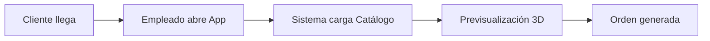
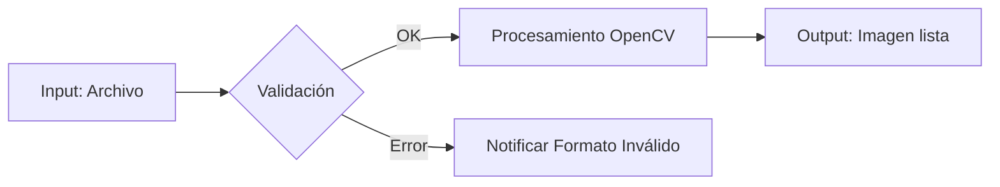
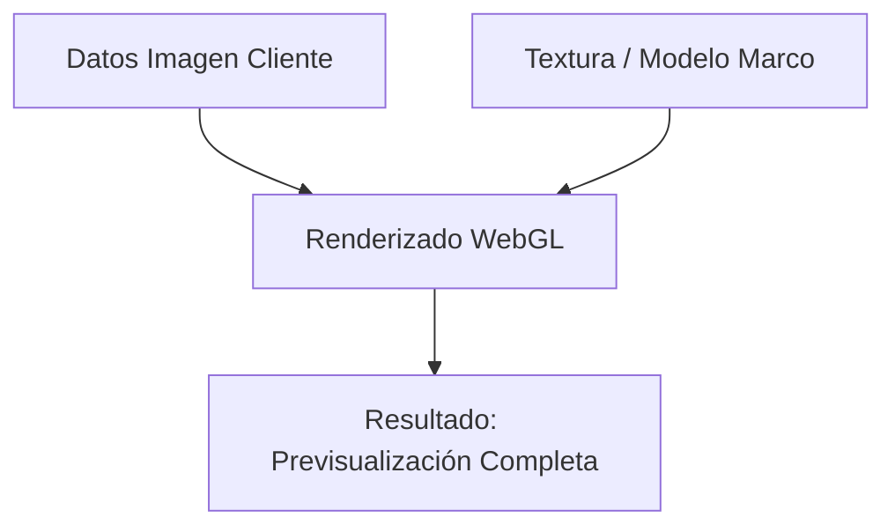
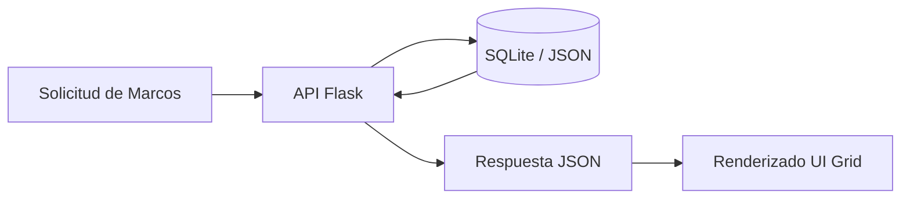
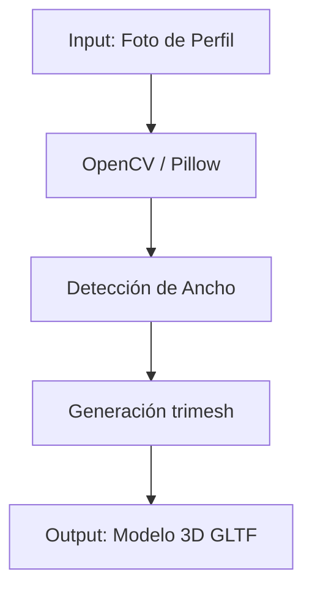
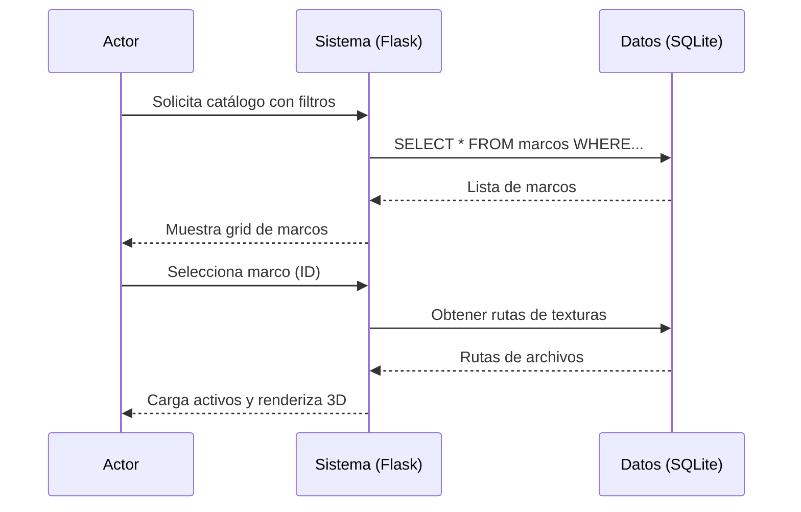
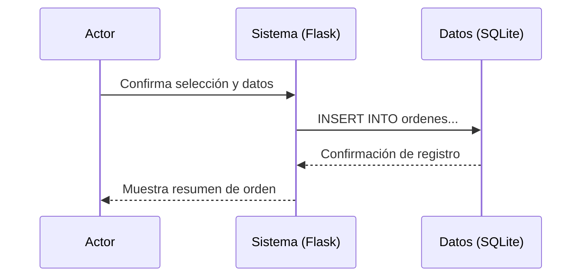

# ARQ-02: Flujo del Sistema
**Responsable:** Analista de Gobernanza y Diseño
**Entradas:** Especificación de Requerimientos y Casos de Uso
**Salidas:** Arquitectura de Componentes y Diseño de Base de Datos

---

## 1. Flujo Principal del Sistema

### 1.1 Flujo de Uso Normal (Happy Path)

### 1.2 Descripción Paso a Paso

| Paso | Actor | Acción | Sistema Responde |
|------|-------|--------|------------------|
| 1 | Cliente | Llega a la tienda con su foto | - |
| 2 | Empleado | Abre la aplicación web (Flask) | Muestra la interfaz principal |
| 3 | Cliente/Empleado | Sube foto del cliente | Valida y muestra la foto en el canvas |
| 4 | Empleado | Consulta catálogo con filtros | Muestra grid de marcos (vía Flask API) |
| 5 | Cliente | Selecciona un marco | Carga textura y modelo 3D del marco |
| 6 | Sistema | Renderiza previsualización 3D | Muestra foto con el marco (Three.js) |
| 7 | Cliente | Ajusta preferencias | Actualiza render en tiempo real |
| 8 | Empleado | Genera la orden final | Crea registro de orden y resumen técnico |

## 2. Flujo de Carga de Imagen

## 3. Flujo de Previsualización 3D

## 4. Flujo de Catálogo

## 5. Flujo de Generación de Modelos 3D (Herramienta Python)

## 6. Diagramas de Secuencia

### 6.1 Secuencia: Seleccionar Marco

### 6.2 Secuencia: Generar Orden

## 7. Estados del Sistema

| Estado | Descripción | Transiciones |
|--------|-------------|--------------|
| **Inicializando** | Carga de recursos (Flask Startup) | -> Listo |
| **Listo** | Esperando interacción del usuario | -> Procesando |
| **Procesando** | Ejecutando OpenCV o Render 3D | -> Listo, -> Error |
| **Error** | Fallo en carga o procesamiento | -> Listo (Reset) |

## 8. Referencias

- [[03-Diseño/01-Ingenieria_Arquitectura/01-STD-04_Diagrama_Componentes]]
- [[03-Diseño/01-Ingenieria_Arquitectura/03-STD-06_Modelo_Datos]]
- [[03-Diseño/00-PROC-03_Diseño_Sistema|PROC-03]]