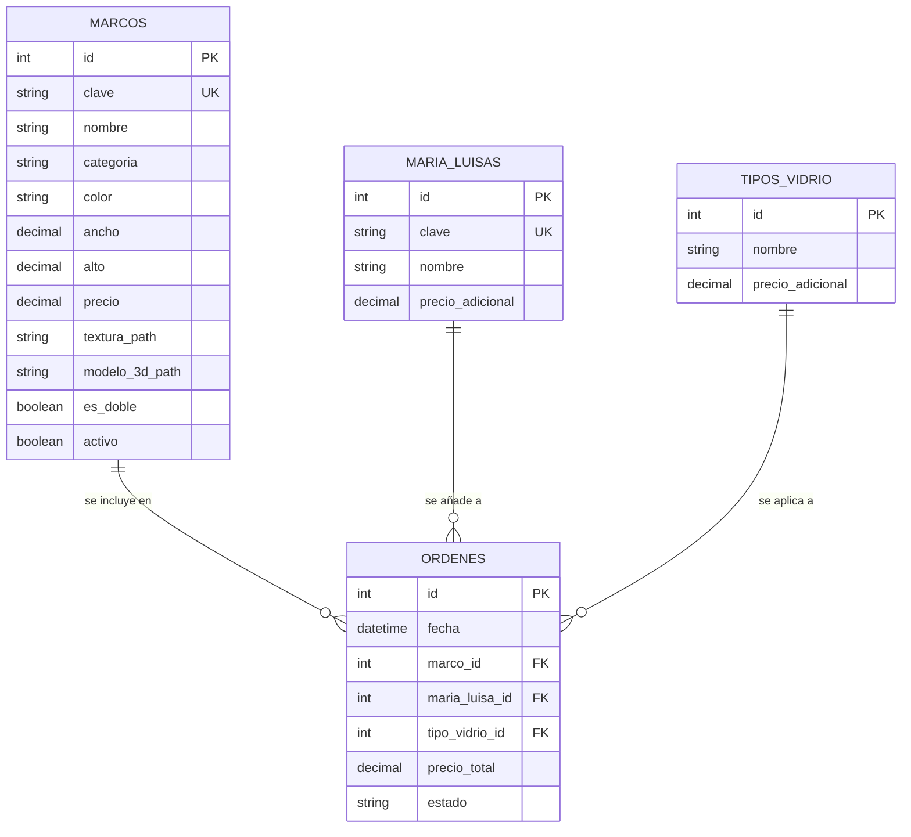

# ARQ-03: Modelo de Datos
**Responsable:** Analista de Gobernanza y Diseño
**Entradas:** Especificación de Requerimientos y Casos de Uso
**Salidas:** Arquitectura de Componentes y Diseño de Base de Datos

---

## 1. Esquema de Datos

El sistema utiliza un esquema relacional para gestionar el catálogo de marcos y las órdenes de clientes. Para la implementación, se utiliza **SQLite** (por su ligereza y portabilidad) o un sistema basado en archivos **JSON** para el catálogo estático.

## 2. Definición de Entidades

### 2.1 Entidad: marcos

Almacena la información técnica y comercial de todos los marcos.

### 2.2 Atributos Detallados (Tabla: marcos)

| Campo | Tipo | Descripción | Restricciones |
|-------|------|--------------|---------------|
| id | INTEGER | Identificador único | PK, AUTOINCREMENT |
| clave | TEXT | Código único del marco | UNIQUE, NOT NULL |
| nombre | TEXT | Nombre comercial | - |
| categoria | TEXT | Clasificación (Clásico, Moderno, etc.) | - |
| color | TEXT | Color predominante | - |
| ancho | REAL | Ancho en centímetros | NOT NULL |
| alto | REAL | Alto en centímetros | NOT NULL |
| precio | REAL | Precio base en MXN | - |
| textura_path | TEXT | Ruta al archivo de textura 2D | - |
| modelo_3d_path | TEXT | Ruta al archivo GLTF/OBJ | - |
| es_doble | BOOLEAN | Indica si es marco doble | DEFAULT FALSE |
| activo | BOOLEAN | Disponibilidad en catálogo | DEFAULT TRUE |

## 3. Especificaciones Técnicas

### 3.1 Tipos de Vidrio

| Nombre | Descripción | Precio Adicional |
|--------|-------------|------------------|
| Normal | Vidrio estándar transparente | $0 |
| Antirreflejo | Tratamiento para reducir brillos | $150 |
| Templado | Mayor resistencia a impactos | $250 |

### 3.2 Lógica de Relacionamiento

1. **Catálogo**: El sistema carga la lista de marcos activos al inicio de la aplicación para permitir filtrado instantáneo en el frontend.
2. **Órdenes**: Cada orden guarda una referencia al ID del marco seleccionado y captura el precio final en el momento de la generación para evitar cambios retroactivos por actualización de catálogo.
3. **Activos**: Las rutas de texturas y modelos 3D son relativas a la carpeta `static/assets/` del servidor Flask.

## 4. Índices de Búsqueda (Optimización)

Para asegurar la fluidez de la interfaz, se definen índices sobre los campos de filtrado más comunes:
- `idx_marcos_categoria`
- `idx_marcos_color`
- `idx_marcos_ancho`
- `idx_marcos_activo`

## 5. Resumen de Almacenamiento

| Entidad | Registros Estimados | Formato de Almacenamiento |
|---------|---------------------|---------------------------|
| marcos | ~1,079 | SQLite / JSON |
| maria_luisas | ~50 | SQLite / JSON |
| tipos_vidrio | 3 | Constantes en Código / DB |
| ordenes | Variable | SQLite |

## 6. Referencias

- [[03-Diseño/01-Ingenieria_Arquitectura/01-STD-04_Diagrama_Componentes]]
- [[03-Diseño/01-Ingenieria_Arquitectura/02-STD-05_Flujo_Sistema]]
- [[02-Requisitos/01-Ingenieria_Requisitos/01-Aprobados/04-REQ-06_Datos_Catalogo|REQ-06 Datos Catálogo]]
- [[03-Diseño/00-PROC-03_Diseño_Sistema|PROC-03]]