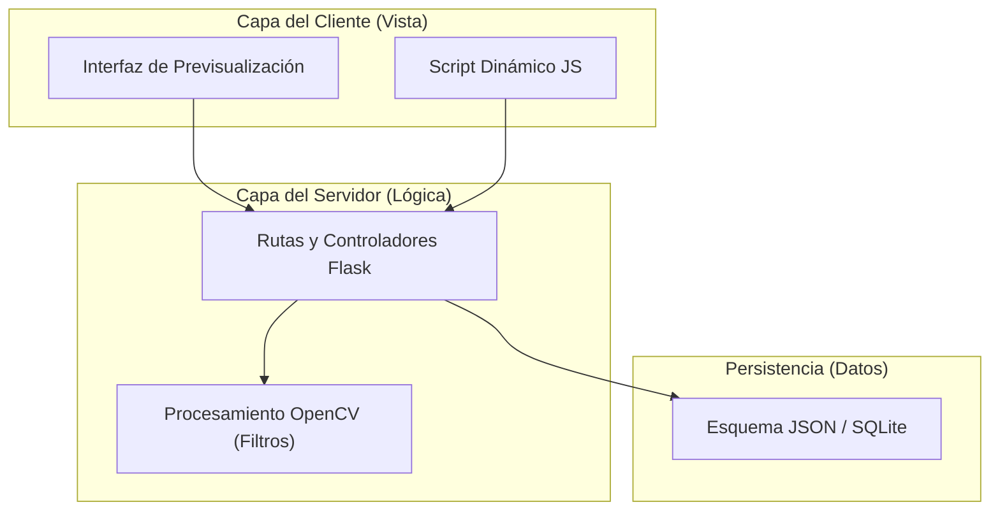
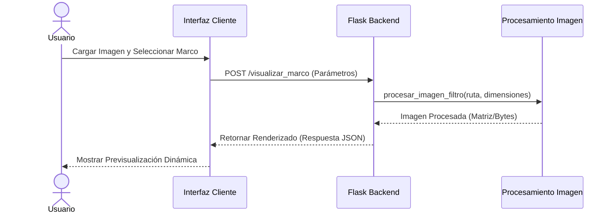

# Plantilla de Diagrama de Arquitectura

**Responsable:** Analista de Gobernanza y Diseño  
**Entradas:** Especificación de Requisitos de Software (SRS) aprobada y fronteras técnicas de diseño de software.  
**Salidas:** Diagramas de arquitectura del sistema consistentes en formato descriptivo Mermaid.js bajo IEEE Std 1016.  

---

## 1. Guía de Notación y Estilo

Todo diagrama técnico incorporado al SGC del proyecto *Visualizador de Marcos* debe diseñarse empleando la notación formal declarada en **Mermaid.js** y representarse como un bloque de código renderizable nativamente en Obsidian. Se prohíbe el uso de imágenes externas estáticas y de wikilinks para placeholders dentro de las etiquetas de nodos. Toda etiqueta debe usar nombres genéricos o código simple.

---

## 2. Puntos de Vista Arquitectónicos en Mermaid.js (IEEE Std 1016-2009)

### 2.1 Punto de Vista de Descomposición (Lógica)
Use esta plantilla para modelar cómo se dividen los módulos lógicos lógicos de software del sistema:

### 2.2 Punto de Vista de Comportamiento Dinámico (Proceso)
Use esta plantilla de diagrama de secuencia para modelar la comunicación temporal entre componentes de software:

---

## 3. Control de Entregables Generados

A continuación se detalla la gobernanza del diagrama resultante de la plantilla:

| Artefacto Generado | Código | Estándar de Respaldo | Estado |
|---|---|---|---|
| Diagrama de Arquitectura de Software | DIA-VAL-XX | IEEE Std 1016-2009 | [Estado del documento] |

*Aprobación:* Autorizado y verificado digitalmente por el rol responsable bajo el Estándar XookTech v2.0.
