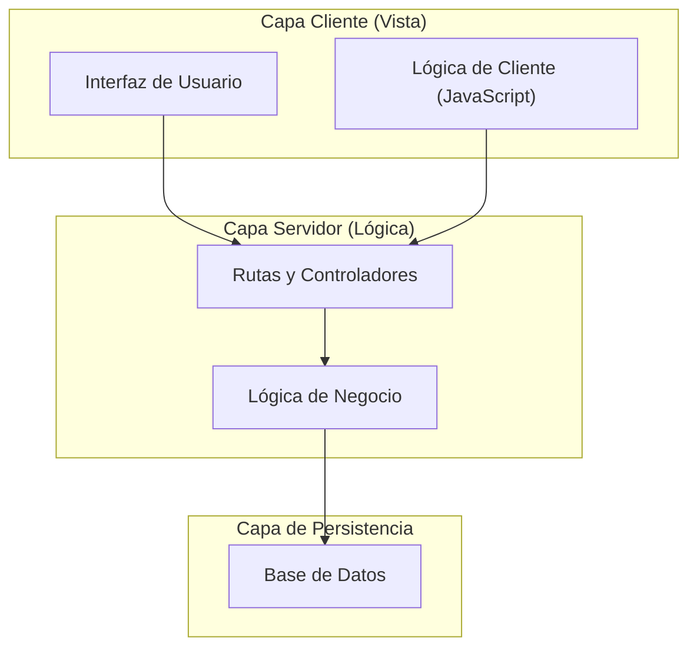
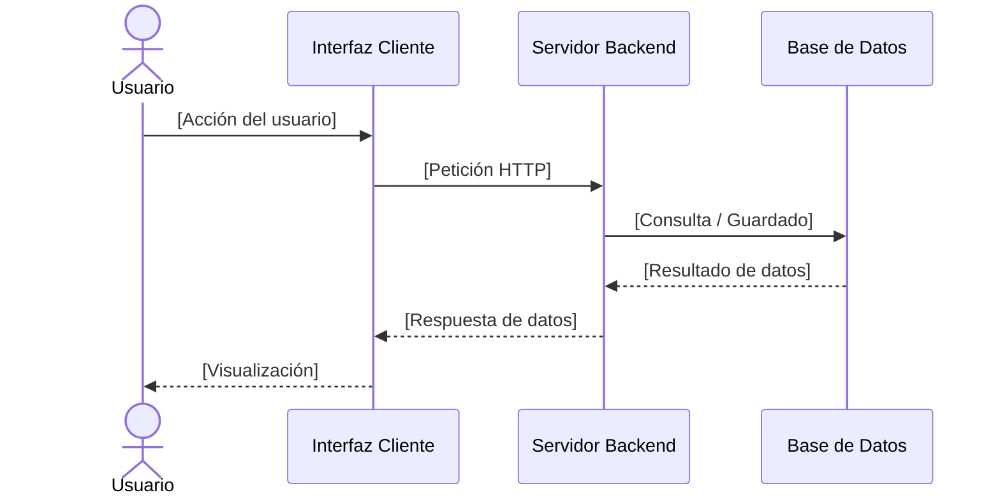

# Plantilla de Diagrama de Arquitectura

**Responsable:** Analista de Gobernanza y Diseño  
**Entradas:** Especificación de Requisitos y decisiones técnicas.  
**Salidas:** Diagramas de arquitectura del sistema en Mermaid.js.  

---

## 1. Guía de Estilo

Los diagramas técnicos deben escribirse utilizando **Mermaid.js** para que se rendericen directamente en Obsidian. Se prohíbe el uso de imágenes externas.

---

## 2. Diagramas de Ejemplo

### 2.1 Vista Lógica (Descomposición de Componentes)



### 2.2 Vista de Comportamiento (Secuencia)



### 2.3 Estructura Física (Estructura de Directorios)

```
proyecto/
├── app/
│   ├── __init__.py
│   ├── rutas.py
│   ├── modelos.py
│   └── servicios.py
├── static/
│   ├── css/
│   └── js/
├── templates/
├── tests/
├── requirements.txt
└── config.py
```

---

## 3. Control del Artefacto
* **Código de documento:** DIA-VAL-XX  
* **Estándar:** IEEE 1016  
* **Estado:** [Pendiente / Aprobado]  
