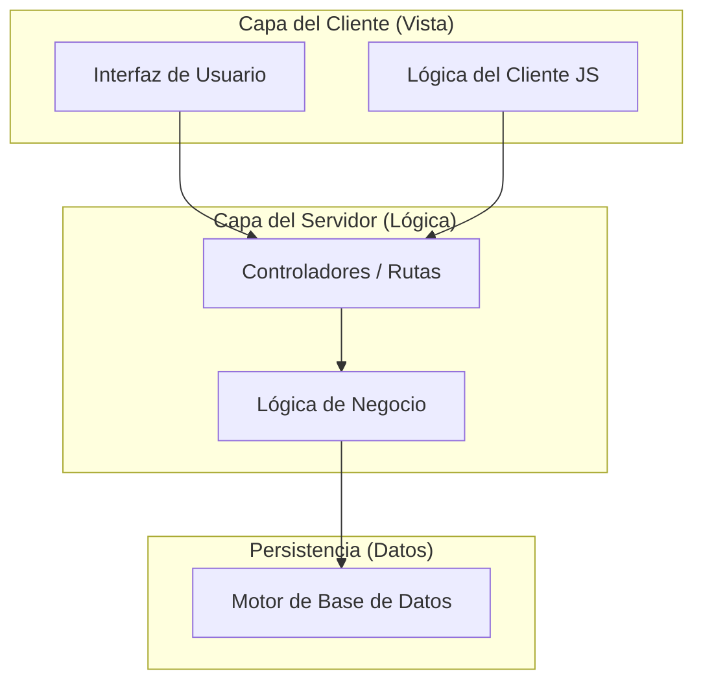
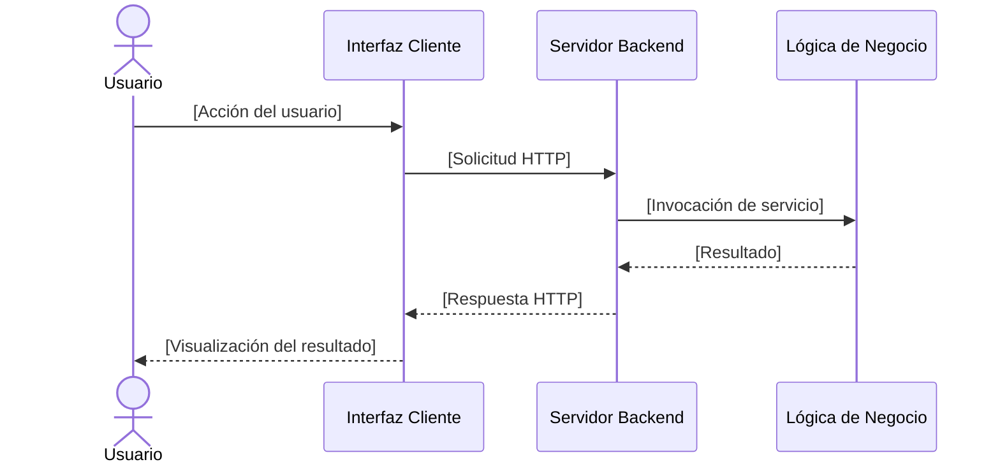

# Plantilla de Diagrama de Arquitectura

**Responsable:** Analista de Gobernanza y Diseño  
**Entradas:** Especificación de Requisitos de Software (SRS) aprobada y decisiones de arquitectura documentadas.  
**Salidas:** Diagramas de arquitectura del sistema en formato Mermaid.js bajo IEEE Std 1016-2009.  

---

## 1. Guía de Notación y Estilo

Todo diagrama técnico incorporado al SGC del proyecto debe diseñarse empleando la notación formal declarada en **Mermaid.js** y representarse como un bloque de código renderizable nativamente en Obsidian. Se prohíbe el uso de imágenes externas estáticas y de wikilinks para placeholders dentro de las etiquetas de nodos. Toda etiqueta debe usar nombres genéricos o código simple.

---

## 2. Puntos de Vista Arquitectónicos en Mermaid.js (IEEE Std 1016-2009)

### 2.1 Punto de Vista de Descomposición (Lógica)
Use esta plantilla para modelar la división en componentes lógicos del sistema:



### 2.2 Punto de Vista de Comportamiento Dinámico (Proceso)
Use esta plantilla de diagrama de secuencia para modelar la comunicación temporal entre componentes:



### 2.3 Punto de Vista Físico (Estructura de Directorios)
Use esta plantilla para documentar la distribución física del código:

```
proyecto/
├── app/
│   ├── __init__.py
│   ├── rutas.py
│   ├── modelos.py
│   └── servicios.py
├── static/
│   ├── css/
│   └── js/
├── templates/
├── tests/
├── requirements.txt
└── config.py
```

---

## 3. Control de Entregables Generados

| Artefacto Generado | Código | Estándar de Respaldo | Estado |
|---|---|---|---|
| Diagrama de Arquitectura de Software | DIA-VAL-XX | IEEE Std 1016-2009 | [Estado del documento] |
