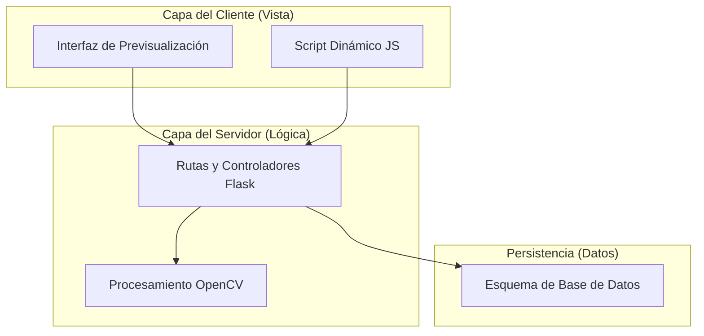
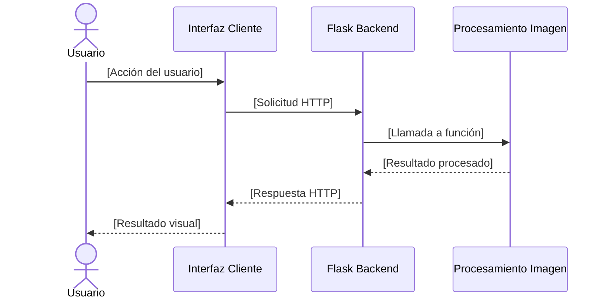

# Plantilla de Documento de Descripción de Diseño de Software (SDD)

**Responsable:** Analista de Gobernanza y Diseño  
**Entradas:** Especificación de Requisitos de Software (SRS) aprobada, Registro de Decisiones de Arquitectura y restricciones tecnológicas del proyecto.  
**Salidas:** Documento de Descripción de Diseño de Software (SDD) estructurado bajo el estándar IEEE Std 1016-2009 con las cuatro vistas arquitectónicas obligatorias.  

---

## 1. Introducción

### 1.1 Propósito
[Describir el propósito del presente documento SDD y el sistema de software al que va dirigido.]

### 1.2 Alcance del Diseño
[Definir las fronteras técnicas y lógicas del diseño de software, explicando qué componentes cubre y cómo implementa la especificación de requisitos.]

### 1.3 Glosario de Términos
| Término | Definición |
|---|---|
| [Término 1] | [Definición de términos arquitectónicos o de componentes] |

### 1.4 Referencias Académicas y Normativas
[Listar los libros de arquitectura de software, estándares y normas que respaldan este diseño.]

---

## 2. Decisiones de Arquitectura (CMMI-DEV v2.0 TS SP 1.1)

### 2.1 Alternativas Evaluadas
| Componente | Alternativa A | Alternativa B | Selección | Justificación |
|---|---|---|---|---|
| [Framework Web] | [Flask] | [FastAPI] | [Selección] | [Criterios técnicos] |
| [Procesamiento de Imágenes] | [OpenCV] | [Pillow] | [Selección] | [Criterios técnicos] |
| [Persistencia de Datos] | [SQLite] | [JSON] | [Selección] | [Criterios técnicos] |

---

## 3. Puntos de Vista de la Arquitectura de Software (IEEE Std 1016-2009)

### 3.1 Punto de Vista de Descomposición (Decomposition Viewpoint)
[Describir la descomposición modular y jerárquica del sistema en subsistemas y componentes lógicos de software, utilizando diagramas de componentes en Mermaid.js.]



### 3.2 Punto de Vista de Comportamiento Lógico (Logical Viewpoint)
[Describir el flujo dinámico y la secuencia de interacción entre componentes de software mediante diagramas de secuencia.]



### 3.3 Punto de Vista Físico (Physical Viewpoint)
[Mapear la distribución física del código en el disco, describiendo la estructura de directorios del repositorio, archivos estáticos y configuración.]

```
proyecto/
├── app/
│   ├── __init__.py
│   ├── rutas.py
│   ├── modelos.py
│   └── procesamiento.py
├── static/
│   ├── css/
│   └── js/
├── templates/
│   └── index.html
├── requirements.txt
└── config.py
```

### 3.4 Punto de Vista de Datos (Data Viewpoint)
[Especificar el diseño detallado del modelo de persistencia: tablas, llaves primarias, tipos de datos, restricciones de integridad y relaciones.]

| Tabla/Entidad | Campo | Tipo | Restricción | Descripción |
|---|---|---|---|---|
| [Tabla 1] | [campo_1] | [INTEGER] | [PK, NOT NULL] | [Descripción del campo] |

---

## 4. Interfaces de Componentes y APIs

### 4.1 Interfaces del Backend
[Definir la signatura técnica, parámetros de entrada y salida, y tipos de retorno de las funciones y rutas de la aplicación.]

*   `nombre_funcion(param1: tipo, param2: tipo) -> tipo_retorno`
    *   *Descripción:* [Explicar la responsabilidad de la función]
    *   *Ruta HTTP:* [Método y ruta, si aplica]
    *   *Códigos de respuesta:* [200, 400, 500, etc.]

### 4.2 Interfaces del Cliente (Frontend)
[Describir la maquetación de la interfaz gráfica y los eventos interactivos que interactúan con las llamadas al backend.]

---

## 5. Trazabilidad del Diseño con Requisitos

| ID Requisito | Elemento de Diseño | Componente SDD | Estado |
|---|---|---|---|
| REQ-XXX | [Componente/Interfaz/Tabla] | [Sección del SDD] | [Mapeado / Pendiente] |

---

## 6. Control de Entregables Generados

| Artefacto Generado | Código | Estándar de Respaldo | Estado |
|---|---|---|---|
| Descripción de Diseño de Software | SDD-VAL-XX | IEEE Std 1016-2009 | [Estado del documento] |
