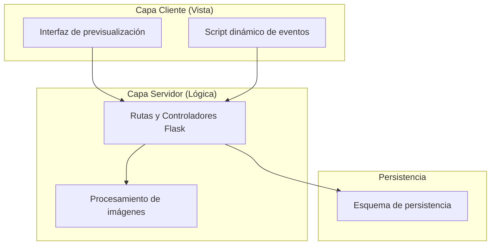
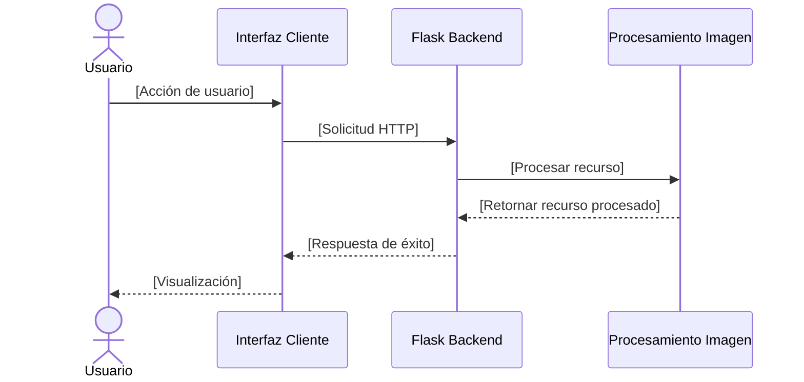

# Plantilla de Descripción de Diseño de Software (SDD)

**Responsable:** Analista de Gobernanza y Diseño  
**Entradas:** Requisitos aprobados y decisiones técnicas.  
**Salidas:** Documento de diseño arquitectónico estructurado.  

---

## 1. Introducción

### 1.1 Propósito
[Describir el propósito del documento de diseño.]

### 1.2 Alcance del Diseño
[Fronteras del diseño, qué componentes cubre y cómo implementa los requisitos.]

### 1.3 Glosario
| Término | Definición |
|---|---|
| | |

---

## 2. Decisiones de Arquitectura

### 2.1 Tabla de Decisiones Técnicas
| Componente / Capa | Alternativa A | Alternativa B | Selección | Justificación Técnica |
|---|---|---|---|---|
| [Framework Web] | Flask | FastAPI | [Selección] | [Justificación] |
| [Procesamiento] | OpenCV | Pillow | [Selección] | [Justificación] |
| [Base de datos] | SQLite | JSON | [Selección] | [Justificación] |

---

## 3. Vistas de la Arquitectura de Software

### 3.1 Vista de Descomposición (Componentes)
[Describir los módulos principales mediante diagramas de componentes en Mermaid.js.]



### 3.2 Vista de Comportamiento Lógico (Secuencia)
[Modelar las interacciones dinámicas temporales mediante diagramas de secuencia.]



### 3.3 Vista Física (Distribución en Disco)
[Describir la estructura física de archivos y carpetas del repositorio.]

```
proyecto/
├── app/
│   ├── __init__.py
│   ├── rutas.py
│   ├── modelos.py
│   └── procesamiento.py
├── static/
│   ├── css/
│   └── js/
├── templates/
│   └── index.html
├── requirements.txt
└── config.py
```

### 3.4 Vista de Datos (Modelo de Datos)
[Modelado de tablas, campos, llaves, tipos y restricciones.]

| Entidad / Tabla | Campo | Tipo | Restricciones | Descripción |
|---|---|---|---|---|
| | | | | |

---

## 4. Interfaces y APIs

### 4.1 Interfaces del Backend
[Definición de signaturas de funciones y rutas HTTP.]

* `nombre_funcion(param: tipo) -> retorno`
  * *Descripción:* [Objetivo de la función]
  * *Ruta HTTP:* [Ruta y método HTTP]
  * *Respuestas:* [Códigos HTTP y esquemas JSON]

### 4.2 Interfaces del Cliente
[Eventos y llamadas AJAX del frontend hacia el backend.]

---

## 5. Trazabilidad con Requisitos

| ID Requisito | Componente Lógico / Interfaz | Sección del SDD | Estado |
|---|---|---|---|
| REQ-XX | | | [Mapeado / Pendiente] |

---

## 6. Control del Artefacto
* **Código de documento:** SDD-VAL-XX  
* **Estándar:** IEEE 1016  
* **Estado:** [Pendiente / Aprobado]  
