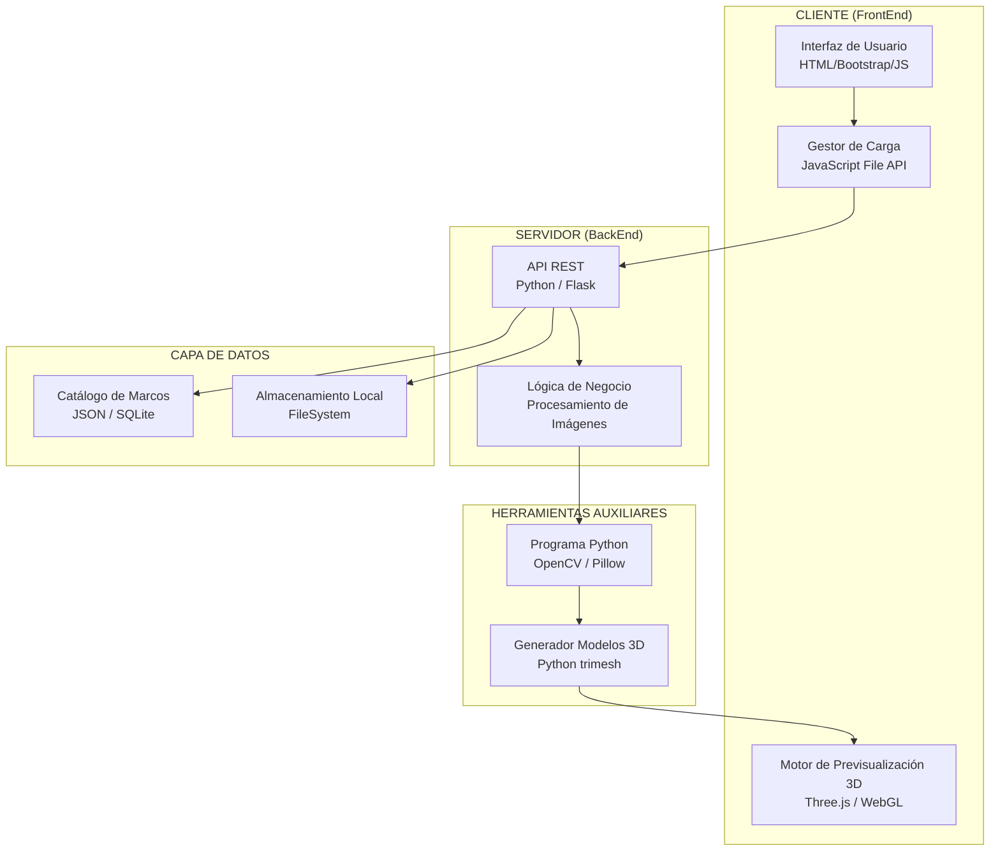
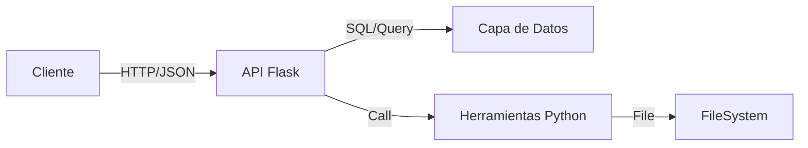
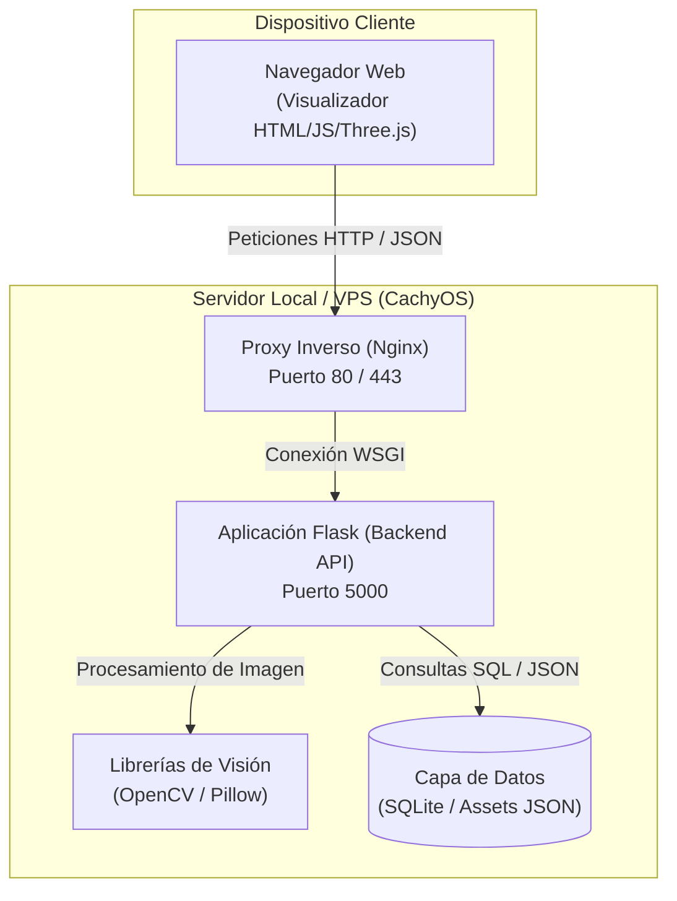

# ARQ-01: Diagrama de Componentes del Sistema
**Responsable:** Analista de Gobernanza y Diseño
**Entradas:** Especificación de Requerimientos y Casos de Uso
**Salidas:** Arquitectura de Componentes y Diseño de Base de Datos

---

## 1. Vista General de la Arquitectura

## 2. Componentes Principales

### 2.1 Capa de Presentación (Frontend)

| Componente                             | Descripción                                  | Tecnología               |
| -------------------------------------- | -------------------------------------------- | ------------------------ |
| **Interfaz de Usuario**          | Página web responsive para uso en tienda     | HTML5, Bootstrap 5, CSS3 |
| **Gestor de Carga de Imágenes**  | Componente para subir fotos de clientes      | JavaScript, File API     |
| **Motor de Previsualización 3D** | Renderiza el marco sobre la foto del cliente | Three.js, WebGL          |
| **Catálogo de Marcos**           | Visualización grid de marcos con filtros     | JavaScript, CSS Grid     |

### 2.2 Capa de Lógica de Negocio (Backend)

| Componente                       | Descripción                            | Tecnología       |
| -------------------------------- | -------------------------------------- | ---------------- |
| **API REST**               | Endpoints para operaciones del sistema | Python, Flask    |
| **Gestor de Catálogo**     | Búsqueda y filtrado de marcos          | Python, SQLite/JSON |
| **Procesador de Imágenes** | Resize y detección de bordes           | Python, OpenCV   |
| **Render Engine**          | Generación de texturas dinámicas       | Python, Pillow   |

### 2.3 Capa de Datos

| Componente                   | Descripción                                  | Tecnología        |
| ---------------------------- | -------------------------------------------- | ----------------- |
| **Catálogo de Marcos** | Base de datos de especificaciones            | SQLite / JSON     |
| **Imágenes/Texturas**  | Almacenamiento de fotos de marcos            | File system       |

### 2.4 Herramientas Auxiliares

| Componente                        | Descripción                                      | Tecnología      |
| --------------------------------- | ------------------------------------------------ | --------------- |
| **Detector de Ancho**       | Analiza fotos de marcos para obtener dimensiones | Python, OpenCV  |
| **Generador de Modelos 3D** | Crea modelos 3D a partir de texturas 2D          | Python, trimesh |

## 3. Comunicación entre Componentes

### 3.1 Flujo de Datos

### 3.2 APIs y Puertos

| Servicio    | Puerto | Protocolo  | Descripción       |
| ----------- | ------ | ---------- | ----------------- |
| Frontend    | 80/443 | HTTP/HTTPS | Servido por Nginx |
| Backend API | 5000   | HTTP       | Python Flask      |
| SSH         | 22     | SSH        | Administración    |

## 4. Diagrama de Despliegue

## 5. Dependencias Externas

| Dependencia | Versión | Uso                     |
| ----------- | ------- | ----------------------- |
| Python      | 3.10+   | Runtime del backend     |
| Flask       | 2.x     | Framework Web           |
| OpenCV      | 4.x     | Procesamiento de imagen |
| Three.js    | 0.160+  | Renderizado 3D          |
| Bootstrap   | 5.3     | Framework CSS           |

## 6. Referencias

- [[03-Diseño/03-PROC-03_Diseño_Sistema|PROC-03]]
- [[03-Diseño/01-Ingenieria_Arquitectura/03-STD-06_Modelo_Datos|STD-06]]
- [[03-Diseño/01-Ingenieria_Arquitectura/04-STD-07_Arquitectura_Python|STD-07]]