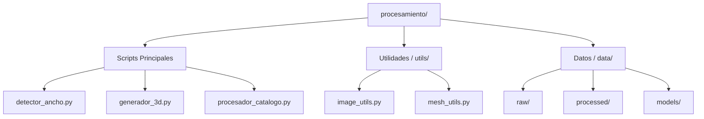
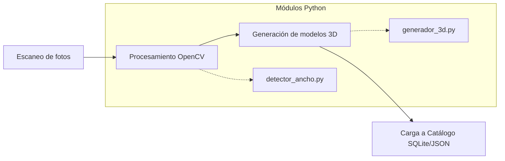

# ARQ-04: Arquitectura de Módulos Python

**Responsable:** Analista de Gobernanza y Diseño  
**Entradas:** Especificación de Requerimientos y Casos de Uso  
**Salidas:** Arquitectura de Componentes y Diseño de Base de Datos  

---

## 1. Descripción General

El proyecto utiliza programas en Python como herramientas auxiliares para el procesamiento de imágenes y generación de modelos 3D. Estos módulos se ejecutan de manera independiente al sistema principal y alimentan el catálogo de marcos (SQLite/JSON).

## 2. Módulos Principales

### 2.1 Módulo: detector_ancho.py

**Propósito:** Detectar automáticamente el ancho de un marco a partir de una fotografía de perfil.

```python
# detector_ancho.py
# Dependencias: opencv-python, numpy, scipy
```

**Funcionalidad:**
- Recibe una imagen lateral del marco.
- Detecta los bordes del marco usando procesamiento de imagen (Canny).
- Calcula el ancho en centímetros usando una referencia conocida.
- Genera un reporte JSON con las dimensiones detectadas.

### 2.2 Módulo: generador_3d.py

**Propósito:** Generar modelos 3D (.glb) a partir de texturas 2D escaneadas.

```python
# generador_3d.py
# Dependencias: trimesh, numpy, PIL
```

**Funcionalidad:**
- Crea una malla 3D rectangular con el grosor detectado.
- Aplica la textura frontal sobre la malla generada.
- Exporta en formato GLTF/GLB compatible con Three.js.

### 2.3 Módulo: procesador_catalogo.py

**Propósito:** Batch processing de imágenes para optimización web.
- Redimensión a 1024x1024 px.
- Compresión con Pillow.
- Generación automática de thumbnails.

## 3. Estructura de Archivos del Pipeline



## 4. Flujo de Trabajo Técnico



## 5. Integración con el Sistema Principal Flask

Los módulos Python generan salidas que son consumidas directamente por la aplicación web:

| Output Python | Formato | Consumido por |
|---------------|---------|----------------|
| Texturas optimizadas | .jpg / .webp | Frontend (CSS/Three.js) |
| Modelos 3D | .glb | Frontend (Three.js) |
| Metadatos Técnicos | .json | Backend (API Flask / SQLite) |

## 6. Comandos de Ejecución

```bash
# Procesar todo el catálogo y actualizar base de datos local
python -m pipeline.procesar_todo --input ./fotos --db ./data/marcos.db

# Generación individual de modelo 3D
python generador_3d.py --textura tex_001.jpg --ancho 5.2 --output marco_001.glb
```

## 7. Referencias

- [[09-Notes/03-Diseño-Preview/01-Ingenieria_Diseño/01-STD-04_Diagrama_Componentes|STD-04]]
- [[09-Notes/03-Diseño-Preview/01-Ingenieria_Diseño/02-STD-05_Flujo_Sistema|STD-05]]
- [[02-Requisitos/01-Ingenieria_Requisitos/01-Aprobados/06-REQ-03_Generacion_Marcos_3D|REQ-03 Generación Marcos 3D]]
- [[09-Notes/03-Diseño-Preview/03-PROC-03_Diseño_Sistema|PROC-03]]