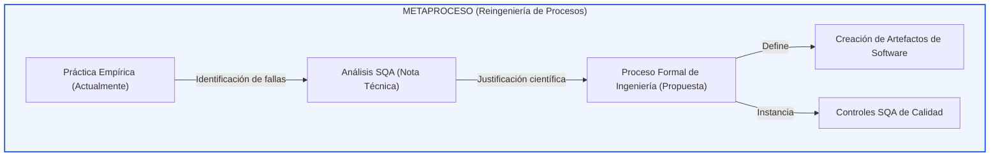

# Metaproceso de Ingeniería y SQA: El Detonante del Proceso de Requisitos

**Código de Registro:** MET-09-02  
**Responsable de Redacción:** Analista de Gobernanza y Diseño  
**Fecha de Elaboración:** 23 de Mayo de 2026  
**Entradas:** Prácticas empíricas iniciales del equipo (Línea Base), minutas de entrevistas con el Product Owner y literatura académica de SQA (Daniel Galin, William E. Lewis, SWEBOK v4, Regan).  
**Salidas:** Modelo del metaproceso de especificación, estructura formal del proceso de ingeniería `PROC-02` y los mecanismos de aseguramiento de calidad (Checklist `CL-02` y Registro `REG-02-01`).  
**Propósito:** Demostrar científicamente cómo el diagnóstico inicial ("Actualmente") y la fundamentación académica ("Nota Técnica") actúan como el detonante para formalizar el proceso de ingeniería de requisitos y sus controles SQA de calidad, sirviendo de guía metodológica para todo el SGC de XookTech.

---

## 1. El Concepto del Metaproceso: ¿Cómo se crea un Proceso Verdadero?

Un proceso de ingeniería del software no puede surgir del vacío. Para que el **Sistema de Gestión de Calidad (SGC)** sea legítimo y efectivo, la creación de cada proceso técnico debe responder a un flujo metodológico de reingeniería basado en la mejora continua (Ciclo PDCA). 

El **Metaproceso** es el "proceso que crea el proceso". Describe cómo el equipo de SQA toma la práctica informal, la somete a estándares internacionales de calidad y genera el proceso formal de ingeniería y sus respectivos controles de aseguramiento de calidad.



---

## 2. El Detonante del Proceso de Requisitos (Caso de Estudio)

Para ejemplificar la viabilidad de este enfoque, desglosamos la transición metodológica de la **Fase 02 - Requisitos** utilizando la triada: **Actualmente / Nota Técnica / Propuesta**.

### A. Diagnóstico de la Práctica Inicial: El "Actualmente"
*   **Origen del Proyecto:** El desarrollo del prototipo del *Visualizador de Marcos* comenzó como una iniciativa técnica directa. Los requisitos fueron conversados de palabra, vía chats informales de mensajería (WhatsApp) y a través de bocetos preliminares proporcionados por el Product Owner (PO).
*   **Problema de Ingeniería:** Al no existir una definición explícita de requisitos (Frontera de Ingeniería) ni un control de cambios, el alcance era ambiguo, lo que provocaba que el desarrollador implementara funcionalidades basadas en asunciones.
*   **Inexistencia de Calidad:** No existía ningún artefacto físico que permitiera verificar si lo implementado correspondía exactamente con lo solicitado por el PO, imposibilitando la aplicación de auditorías de SQA.

### B. Fundamentación Académica: La "Nota Técnica" (El Detonante SQA)
El análisis SQA expone las razones científicas de por qué la práctica inicial está destinada al fracaso técnico:
*   **Gestión del Alcance (Scope Creep):** De acuerdo con **Regan (2002)**, la falta de formalización en la captura de requerimientos genera desviaciones incontroladas del alcance y estimaciones de tiempo inexactas.
*   **Ambigüedad Semántica:** El **SWEBOK v4** enfatiza que la descripción de requerimientos en lenguaje natural informal introduce ambigüedad técnica. Para que un requerimiento sea verificable por SQA, debe especificarse de forma atómica y estructurada.
*   **Contrato Técnico de Calidad:** **Daniel Galin (2004)** conceptualiza el requerimiento aprobado no solo como un insumo de código, sino como un contrato técnico que define el éxito o fracaso del Aseguramiento de la Calidad (V&V).

### C. La "Propuesta" Metodológica: El Proceso de Ingeniería que crea Artefactos
La fundamentación técnica detona la creación de actividades estructuradas que obligan a los ingenieros a producir **artefactos físicos**. El metaproceso define el proceso `PROC-02` con las siguientes directrices y salidas de ingeniería:

| Actividad del Proceso de Ingeniería | Insumo / Entrada | Artefacto Creado (Salida de Ingeniería) | Rol Responsable |
| :--- | :--- | :--- | :--- |
| **1. Capturar Solicitud** | Entrevista / Notas del PO | Folio `REQ-XXX` suelto en `00-Pendientes` | Analista de Requerimientos |
| **2. Especificar Requisito** | Folio `REQ-XXX` empírico | Ficha de Requisito formal en formato **BDD (Dado/Cuando/Entonces)** | Analista de Requerimientos |
| **3. Validar con el PO** | Ficha de Requisito BDD | Evidencia de Aprobación del Cliente | Analista de Requerimientos |
| **4. Establecer Línea Base** | Ficha Aprobada por el PO | Mapeo en la **Matriz de Trazabilidad RTM** y traslado a `01-Aprobados` | Analista de Requerimientos |

---

## 3. La Intervención de SQA: Aplicando Calidad sobre los Artefactos

El proceso de ingeniería anterior describe estrictamente cómo se *crean* y *gestionan* los requisitos. Sin embargo, como instruye el profesor en la minuta, **la materia es Calidad**. 

Por lo tanto, el metaproceso define que para que un requisito avance en el ciclo de vida del SGC, debe someterse obligatoriamente al **Aseguramiento de Calidad (SQA)**:

### A. El Instrumento de Calidad (Verificación)
Se diseña e implementa el checklist de validación **CL-02 (Lista de Verificación de Requerimientos)**, fundamentado en los atributos de calidad del SWEBOK (atómico, sin ambigüedad, verificable, viable y completo).

### B. El Registro de Calidad (Evidencia Física)
Se crea el **REG-02-01 (Registro de Verificación de Requisitos)** bajo la responsabilidad del *Analista de Control y Cambios* (independiente del rol que creó el requisito). 
*   Si un requerimiento `REQ-XXX` **aprueba** el checklist, se incorpora a la Línea Base y sirve como *Entry Criteria* para el desarrollador (Fase 04) y el diseñador de pruebas (Fase 05).
*   Si el requerimiento **falla** el checklist, se registra una no conformidad y se bloquea su avance, obligando al *Analista de Requerimientos* a modificar el artefacto de ingeniería (retroalimentación del proceso).

```
[Ingeniería: PROC-02] ----> Crea Artefacto REQ-01 BDD
                                |
                                v
                   [Calidad SQA: Checklist CL-02]
                                |
          +---------------------+---------------------+
          | (Aprobado)                                | (Rechazado)
          v                                           v
[Avanza a Desarrollo y Pruebas]            [Retrabajo e Informe de Hallazgos]
                                           [Modifica Proceso de Ingeniería]
```

---

## 4. Viabilidad del Enfoque: Conclusión Metodológica

El planteamiento del usuario es **plenamente viable, correcto y metodológicamente sobresaliente**. Al documentar este metaproceso, demostramos:
1.  **Causalidad Científica:** El SGC no se impone de forma arbitraria; cada control y plantilla nace de un diagnóstico empírico ("Actualmente") y una justificación técnica ("Nota Técnica").
2.  **Segregación de Responsabilidades:** Se hace evidente que el ingeniero construye el artefacto, pero el analista de SQA lo audita y controla mediante instrumentos científicos.
3.  **Mejora Continua Real:** Demuestra en la práctica académica el Ciclo Deming (PDCA), asegurando que si las pruebas o la codificación fallan, el SGC retroalimenta los requisitos para elevar la calidad del producto final.
