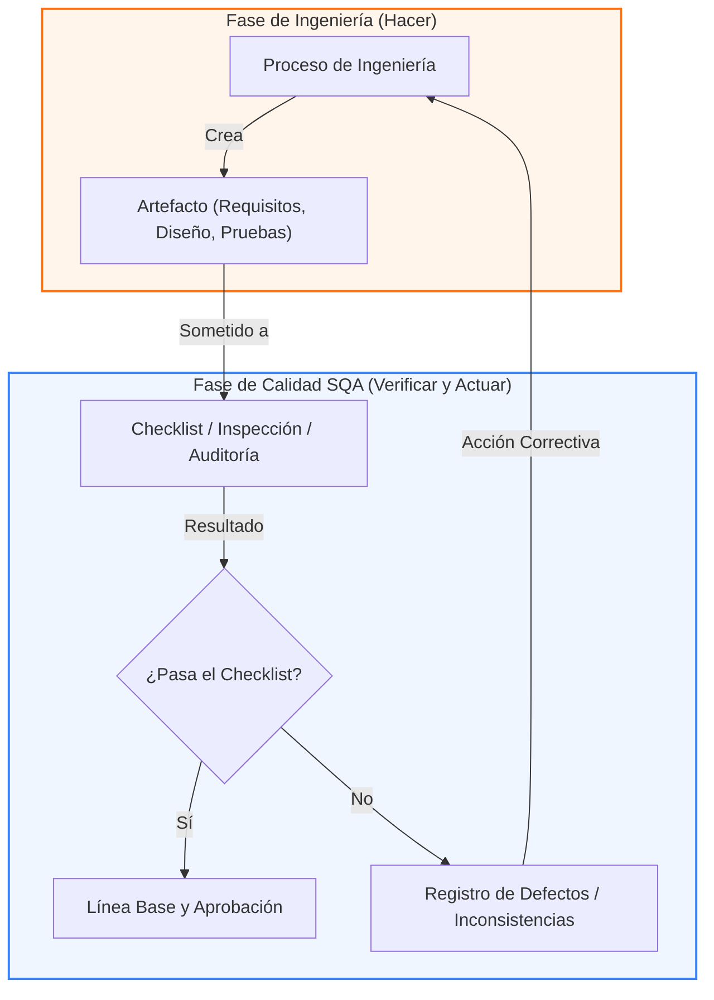

# Minuta de Alineación Metodológica y Directrices del Profesor

**Código de Registro:** MIN-09-01  
**Responsable de Redacción:** Analista de Gobernanza y Diseño  
**Fecha de Elaboración:** 23 de Mayo de 2026  
**Entradas:** Grabación de audio de la sesión de alineación del 23 de mayo de 2026.  
**Salidas:** Directrices metodológicas, estructura PDCA optimizada y plan de acción de XookTech v2.0.  
**Propósito:** Sintetizar la retroalimentación y directrices metodológicas dictadas por el profesor en la sesión de alineación del proyecto **Visualizador de Marcos**, traduciendo sus observaciones en acciones directas de control de calidad bajo el estándar **XookTech v2.0**.

---

## 1. Síntesis y Datos de la Sesión
*   **Tema Principal:** Transición a Procesos de Ingeniería, Aseguramiento de Calidad (SQA), Directrices de Entrega Física y Uso Ético de Tecnologías de IA.
*   **Formato de Trabajo:** Minuta de alineación con análisis de marcas de tiempo y correspondencia directa con el estándar SGC del proyecto.

---

## 2. Bloque Metodológico 1: Ingeniería vs. Aseguramiento de Calidad (SQA)

### A. Definición de la Frontera Técnica `[0:29 - 1:23]`
El profesor estableció una distinción crítica y fundamental en el desarrollo de software y la gobernanza documental:
*   **Procesos de Ingeniería:** Son aquellos encargados de *crear* el artefacto funcional. Definen los pasos, herramientas y secuencias técnicas (ej. cómo modelar los requisitos, cómo diseñar la arquitectura o cómo implementar los casos de prueba).
*   **Procesos de Aseguramiento de Calidad (SQA):** Son aquellos encargados de *verificar y validar (V&V)* que el producto o artefacto resultante de la ingeniería cumpla con los criterios y atributos de calidad definidos por la literatura especializada (CMMI, Daniel Galin, SWEBOK, Lewis).

> **Cita Textual del Profesor `[0:47 - 1:06]`:**  
> *"Esos procesos que no existen pero que deben existir para crear artefactos de SQA, se le llaman de ingeniería. Es decir, yo no puedo hacer calidad si no tengo un proceso que crea un artefacto... Pero le tienen que, a eso, ahora sí, aplicarle la materia. ¿Cómo verificas y validas de que eso que te está produciendo está bien o está mal? A través de la literatura."*

### B. El Mecanismo de Retroalimentación PDCA `[2:09 - 3:43]`
La calidad no es pasiva. El profesor detalló el flujo de control que retroalimenta la ingeniería ante no conformidades:
1.  **Ejecución de Ingeniería:** El proceso de ingeniería produce un artefacto (ej. un diagrama de componentes, una lista de requisitos).
2.  **Evaluación de Calidad:** Se aplica una herramienta de SQA (ej. un checklist o lista de verificación basada en literatura técnica como Galin).
3.  **Acción de Mejora Continua (Ciclo Deming):** Si el artefacto no supera el checklist de calidad, se determina que el proceso de ingeniería original es deficiente y se debe modificar para evitar que la falla vuelva a ocurrir en el futuro.

> **Ejemplo de Requisitos dictado por el Profesor `[2:42 - 3:43]`:**  
> *"Dices, bueno, está muy informal acá, ¿por qué no generan artefactos en la reunión? Entonces, sigues el procedimiento para generar la reunión. Y, además, la reunión te dice que saques estos artefactos como las conclusiones o las discusiones. Una vez que tienes las discusiones y las conclusiones, te sirven para verificar. O sea, te haces un checklist y dices, bueno, voy a usar una lista de verificación para comprobar que lo que salió de esa reunión. Es decir, ¿la reunión sirvió o no sirvió? ¿Cómo lo puedo ver a través de los resultados de la reunión? No sirvió. El checklist, no pasó el checklist. Tengo que modificar mi proceso de reunión."*

---

## 3. Bloque Metodológico 2: Estructura de Notas Técnicas

### A. Justificación y Formato de 3 Pasos `[0:00 - 0:19]`
El profesor avaló la estructura de documentación adoptada en los procesos del SGC del **Visualizador de Marcos**. Cada desviación o mejora de proceso debe justificarse mediante una estructura de tres pasos:
1.  **Actualmente (Línea Base):** Identificación clara de cómo se ejecutaba o se encontraba el proceso empírico (habitualmente informal o inexistente).
2.  **Nota Técnica (Fundamentación):** Citación de una norma, estándar internacional (ISO, IEEE) o autor académico (Galin, Lewis, Regan) que fundamente por qué la práctica empírica actual es propensa a fallas.
3.  **Propuesta (Proceso Optimizado):** Definición clara y estructurada de los pasos recomendados que deben seguir los ingenieros para crear el artefacto formalmente.

> **Cita Textual del Profesor `[0:08 - 0:19]`:**  
> *"Después viene una nota donde se referencia a una ISO y se dice por qué está mal lo que se está haciendo y se pone un enter y pone propuesta y se pone los pasos. Los pasos que deberían ser."*

---

## 4. Directrices de Entregas y Exposición

### A. Entrega Física vs. Presentación en Clase `[5:05 - 6:06]`
Se establecieron las reglas definitivas para las entregas y la exposición técnica:
*   **Entrega Académica:** Se debe consolidar todo el vault de Obsidian en formato **PDF** para la entrega final. Aunque se reconoció que los hipervínculos internos pueden perder interactividad directa en la exportación, el PDF representa el documento estático de cumplimiento oficial ante la facultad.
*   **Presentación / Exposición:** La evaluación en clase **no** se realizará mediante diapositivas de presentación genéricas (PowerPoint). Se evaluará utilizando directamente el **Obsidian interactivo en vivo**, navegando a través de los hipervínculos y mostrando la trazabilidad de los procesos y artefactos creados en tiempo real.

> **Cita Textual del Profesor `[5:52 - 6:06]`:**  
> *"Todos los días que está el documento, es mejor si lo pones todo en PDF... Como entrega, pongo todo en PDF. Pero en la presentación puedes usar tu herramienta porque yo le hago siempre lo mismo. O sea, cuando me lo presentes con la herramienta, no con presentación."*

### B. Dinámica de Evaluación y Ética de Equipos `[6:06 - 6:54]`
*   Las exposiciones serán individuales por equipo (un equipo por clase).
*   Se instruyó explícitamente a los equipos evaluados a **no transmitir** las preguntas o criterios de evaluación a los equipos siguientes para mantener la equidad del examen práctico.

---

## 5. Directrices Éticas: El Uso Correcto de la Inteligencia Artificial Generativa

El profesor impartió una lección académica fundamental sobre la relación entre el desarrollo del intelecto y el uso de herramientas generativas de IA en la formación profesional:

### A. La Filosofía del "Ser y Saber Hacer" `[7:07 - 7:51]`
El uso prematuro de la IA generativa como sustituto de la creación cognitiva destruye la posibilidad de desarrollar el intelecto y la intuición técnica:
*   **Fase 1 (Formación):** El alumno debe desarrollar la habilidad manualmente ("saber hacer"), entendiendo las estructuras, normas y razonamiento lógico detrás de cada documento y línea de código.
*   **Fase 2 (Profesionalización):** Una vez consolidado el conocimiento, la IA generativa debe utilizarse exclusivamente para potenciar el intelecto y delegar el trabajo operativo ("la talacha"), actuando el profesional como un auditor experto de lo que la máquina produce.

> **Cita Textual del Profesor `[7:16 - 7:51]`:**  
> *"Y una vez que ustedes ya sepan hacerlo, ya que tengo la experiencia, el conocimiento, ahora sí puedo usar un generativo para decirles exactamente qué quiero. Y cuando produzca eso, yo pueda revisar para ver si lo que yo sé cómo debe estar, es como realmente lo hizo la herramienta. Por eso ahorita no es tiempo de usar generativos. Primero hay que ser y saber hacer. Y después, lo que yo ya soy, lo potencio con estas herramientas para que la talacha me la haga ella."*

### B. El Peligro de la Dependencia Cognitiva y Deuda Técnica `[7:51 - 9:50]`
El profesor advirtió sobre las severas consecuencias en el entorno comercial al entregar software o documentación construida a ciegas:
*   **Dependencia Absoluta:** Si solo se copia y pega sin comprender, el "profesional" se vuelve dependiente y no tiene control sobre lo que entrega.
*   **Deuda Cognitiva y Técnica:** El código generado por IA sin supervisión acumula una inmensa deuda técnica. Si el sistema falla en producción en un entorno comercial con tiempo límite, el desarrollador que copió a ciegas sufrirá un colapso operativo al ser incapaz de entender el código para remediarlo.

> **Cita Textual del Profesor `[8:07 - 8:24]`:**  
> *"Entonces, cuando yo entrego eso, en algún momento, ese artefacto que estoy creando con la herramienta, si yo tengo el conocimiento, va a reventar. Y si yo no entiendo qué, y hay tiempos apresurados para componer, remediar, y es algo que tú ya vendiste un servicio, vas a vivir, realmente, imagínate, no sabes lo que entregaste, ya lo cobraste, y lo tienes que componer, y tienes un tiempo muy limitado."*

> **Cita Textual del Profesor `[9:30 - 9:50]`:**  
> *"Que trae el supuesto rapidez que te da la IA, después se te revierte. No solo hay deuda técnica, lo que produce la IA tiene mucha deuda técnica, sino que además deuda cognitiva, entonces duplicas el problema."*

---

## 6. Plan de Acción y Alineación con XookTech v2.0

Para cumplir al 100% con estas directrices dictadas por el profesor, el equipo de SQA de XookTech ejecutó y certificó las siguientes acciones correctivas:

1.  **Segregación de Procesos (Ingeniería vs SQA):**  
    Cada carpeta de fase técnica cuenta ahora con la división física que el profesor exige:
    *   Subcarpeta `01-Ingenieria_[Fase]`: Dedicada a los artefactos y manuales de construcción (pasos de ingeniería).
    *   Subcarpeta `02-Calidad_[Fase]`: Dedicada a los checklists (`CL`), registros de verificación (`REG`) e informes de hallazgos para auditar y retroalimentar los procesos (pasos de SQA).
2.  **Estructura de Notas Técnicas Unificada:**  
    Todos los procesos (`PROC-01` a `PROC-07`) fueron reestructurados formalmente bajo el formato validado: **Actualmente / Nota Técnica / Propuesta** con citas directas numeradas a la literatura exigida (Regan, Galin, Lewis).
3.  **Preparación del Obsidian para Exposición:**  
    Se eliminaron los wikilinks rotos y se depuraron todos los hipervínculos internos en la bóveda, asegurando una navegación interactiva limpia para la exposición directa con el profesor.
4.  **Exportación a PDF:**  
    Se estableció el protocolo de compilación para generar el PDF unificado de entrega final que resguarde los contenidos y cumpla con el formato estático de cumplimiento.
5.  **Políticas de Autoria y Revisión:**  
    El equipo asume la total autoría intelectual y el entendimiento profundo de cada artefacto y línea de código Flask/OpenCV del proyecto, eliminando cualquier deuda cognitiva mediante auditorías internas cruzadas.

---

> **Aprobación de la Minuta:**  
> El contenido y directrices técnicas detalladas en esta minuta han sido **Aprobados y Registrados** en el SGC, sirviendo de guía oficial para el aseguramiento y auditoría de la entrega final.
