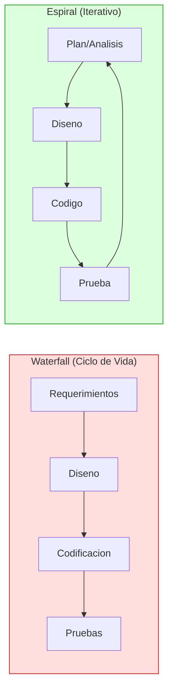

---
tags:
  - SQA
  - testing
  - espiral
  - RAD
  - prototipos
  - JAD
  - lewis
  - metodologia
aliases:
  - Metodologia de Pruebas de Software Espiral
---

# Metodologia del Desarrollo y Pruebas en Espiral

> **Referencia:** Lewis, W. E. (2009). *Software Testing and Continuous Quality
> Improvement* (2nd ed.). USA: Auerbach Publications.
> Seccion III: Software Testing Methodology. Paginas: 98 - 115.

---

## A. Metodologia de Pruebas de Software (p. 98)

Las **metodologias de desarrollo en espiral** (*spiral development*) surgieron
como reaccion al desarrollo tradicional en cascada (*waterfall*), en el que el
producto evoluciona en fases secuenciales con un ciclo de entrega excesivamente
largo.

> [!INFO] Definicion clave
> El termino **espiral** se refiere al hecho de que la secuencia tradicional
> de fases *analisis–diseno–codigo–prueba* se ejecuta a **microescala** dentro
> de cada ciclo o iteracion en un periodo corto, y luego se repite en cada
> ciclo subsiguiente.

**Ventajas fundamentales del desarrollo en espiral:**

- Los usuarios reciben al menos alguna funcionalidad de forma rapida.
- El producto puede moldearse mediante **retroalimentacion iterativa**; los
  usuarios no necesitan definir cada caracteristica correctamente desde el
  inicio, sino que pueden reaccionar a cada iteracion.
- Un sistema inicial pequeno pero funcional se construye y entrega
  rapidamente, y luego se mejora en una serie de iteraciones.

**Caracteristica del enfoque en relacion con las pruebas:**

> Las pruebas en espiral son dinamicas y pueden que nunca se "completen"
> en el sentido tradicional de un sistema entregado.

**Objetivos de la Seccion III de Lewis:**

- Discutir las limitaciones del desarrollo en cascada.
- Describir las complicaciones del entorno cliente/servidor.
- Discutir la psicologia de las pruebas en espiral.
- Describir el entorno de desarrollo iterativo/espiral.
- Aplicar la mejora continua de Deming al entorno espiral en terminos de:
  - Recopilacion de informacion
  - Planeacion de pruebas
  - Diseno de casos de prueba
  - Desarrollo de pruebas
  - Ejecucion y evaluacion de pruebas
  - Matriz de trazabilidad y cobertura
  - Preparacion para el siguiente espiral
  - Pruebas de sistema y de aceptacion
  - Resumen y reporte de resultados

---

## B. Limitaciones del Desarrollo en Ciclo de Vida (pp. 99-100)

Aunque el desarrollo en cascada es muy efectivo para muchas aplicaciones
grandes que requieren mucha potencia de computo (p. ej., DOD, financieras,
aplicaciones de seguridad), presenta varias deficiencias significativas.

### Problemas del Modelo Cascada

| # | Deficiencia                                                                           |
|---|---------------------------------------------------------------------------------------|
| 1 | Los usuarios finales solo se involucran al inicio y al final del proceso              |
| 2 | El sistema entregado frecuentemente no es lo que el usuario visualizo originalmente   |
| 3 | El largo ciclo de desarrollo crea una brecha entre lo necesario y lo entregado        |
| 4 | Se espera que los usuarios describan en detalle lo que quieren antes de la codificacion |
| 5 | Al final de cada fase, con frecuencia no esta completamente terminada                 |
| 6 | El **efecto de cascada** (*rippling effect*): siempre se debe regresar a fases incompletas |
| 7 | La metodologia no siempre se sigue rigurosamente; en la prisa, partes criticas se omiten |
| 8 | El peor caso es el **desarrollo ad hoc**: se bypasean el analisis y diseno, y la codificacion es la primera actividad mayor |
| 9 | Las pruebas se tratan como una fase separada que comienza al final de la codificacion  |
| 10| Un sistema implementado no vale de nada si no es el sistema que el usuario queria     |

> [!WARNING] Consecuencia grave
> Si los requerimientos estan documentados incompletamente, el sistema
> no superara los procedimientos de validacion del usuario. Si el diseno
> es inconsistente con los requerimientos, el producto final probablemente
> fallara la validacion del sistema. Esto llevo a los expertos a publicar
> metodologias basadas en **prototipado**.

---

## C. El Desafio Cliente/Servidor (pp. 100-101)

La **arquitectura cliente/servidor** para el desarrollo de aplicaciones
asigna funcionalidad entre un cliente y un servidor de modo que cada uno
realiza su tarea de forma independiente.

**Componentes del modelo:**

| Componente  | Descripcion                                                                         |
|-------------|-------------------------------------------------------------------------------------|
| **Cliente** | Estacion de trabajo inteligente de un solo usuario; tiene su propio SO y puede correr otras aplicaciones (hojas de calculo, procesadores de texto, etc.) |
| **Servidor** | PC, minicomputadora, LAN o mainframe; recibe solicitudes de los clientes y las procesa |

**Ventajas de las aplicaciones C/S:**
- Costos reducidos
- Mejor accesibilidad a los datos
- Flexibilidad

### Dificultades Adicionales del Entorno C/S

Aunque justificar un enfoque cliente/servidor y asegurar su calidad es
dificil, presenta problemas adicionales que no se encuentran necesariamente
en aplicaciones mainframe:

- La tipica interfaz grafica tiene **mas rutas de logica posibles**, por lo que
  el gran numero de casos de prueba del entorno mainframe se multiplica.
- La tecnologia C/S es complicada, frecuentemente nueva para la organizacion,
  proviene de **multiples proveedores** y se usa en multiples configuraciones
  y versiones.
- El hecho de que las aplicaciones C/S sean **altamente distribuidas** resulta
  en un gran numero de fuentes de falla y problemas de control de configuracion
  hardware/software.
- Debe realizarse un **analisis costo-beneficio** a corto y largo plazo para
  incluir los costos y beneficios organizacionales generales.
- La **migracion exitosa** a C/S depende de hacer coincidir los planes de
  migracion con la disposicion de la organizacion.
- Elegir que aplicaciones seran los mejores candidatos para implementacion C/S
  **no es directo**; requiere analisis.
- La **prueba de integracion** en entornos C/S puede ser desafiante: las
  aplicaciones del cliente y del servidor se construyen por separado y cuando
  se unen, pueden surgir conflictos sin importar que tan bien definidas sean
  las interfaces.

> [!NOTE] Coexistencia de arquitecturas
> En algunos circulos existe la creencia de que el mainframe esta muerto y
> el C/S prevalece. La verdad es que ambas arquitecturas **continuaran
> coexistiendo y complementandose**. Los mainframes no prosperaran como
> en el pasado pero deben ciertamente ser parte de cualquier estrategia C/S.

---

## D. Psicologia de las Pruebas en Espiral Cliente/Servidor (pp. 101-106)

### D.1 La Nueva Escuela de Pensamiento

La **psicologia de las pruebas del ciclo de vida** (cascada) fomenta que las
pruebas sean realizadas por individuos fuera de la organizacion de desarrollo.
La **psicologia de las pruebas en espiral**, por el contrario, fomenta la
**cooperacion** entre aseguramiento de calidad y la organizacion de desarrollo.

> [!INFO] Razon del cambio
> En el entorno de desarrollo rapido de aplicaciones, los requerimientos
> pueden o no estar disponibles en diferentes grados. Sin cooperacion,
> la funcion de pruebas tendria una tarea dificil para definir los
> criterios de prueba.

**El unico enfoque practico:** Que pruebas y desarrollo trabajen juntos.

### D.2 Percepciones Tester/Desarrollador

Las pruebas son un esfuerzo dificil; son la tarea que es **infinita e
indefinida**. Sin importar lo que hagan los testers, no pueden estar seguros
de que encontraran todos los problemas, o incluso todos los importantes.

**Perfil de un buen tester:**
- Pensador critico motivado a producir un producto software de calidad
- Le gusta evaluar entregables de software
- No asume que las pruebas tienen menor estatus que el desarrollo
- Aprendiz rapido y ansioso por aprender
- Buen jugador de equipo
- Capaz de comunicarse efectiva y verbalmente de forma escrita

**Conflicto inherente de roles:**

| Perspectiva      | Orientacion                                                  |
|------------------|--------------------------------------------------------------|
| **Desarrollador** | Comprometido a construir algo exitoso; enfocado en tecnologia |
| **Tester**        | Motivado a minimizar el riesgo de falla y mejorar el software detectando defectos; enfocado en el usuario |

> [!WARNING] Problema tipico
> Los testers tipicamente son ignorados hasta el final del ciclo de
> desarrollo cuando la aplicacion esta completada.

### D.3 Meta del Proyecto: Integrar QA y Desarrollo

La **clave para integrar** las actividades de prueba y desarrollo es que
los testers eviten dar la impresion de que estan para romper el codigo o
destruir el trabajo del desarrollo.

**Rol ideal del tester:**
- Ser un **medidor humano de calidad del producto**.
- Examinar el software, evaluarlo y descubrir si satisface los requerimientos.
- No avergonzar ni quejarse, sino **informar** a desarrollo como mejorar su producto.
- Fomentar la percepcion de ser **los ojos del desarrollador hacia una calidad mejorada**.

**Lo que el tester necesita saber:**
- Los objetivos del producto software
- Como se espera que funcione y como funciona realmente
- El calendario de desarrollo y los cambios propuestos
- El estado de los problemas reportados

**Lo que el desarrollador necesita saber:**
- Que problemas se descubrieron
- Que parte del software funciona o no funciona
- Como perciben los usuarios el software
- Que se probara y el calendario de pruebas
- Los recursos disponibles para pruebas
- El estado actual del esfuerzo de prueba

### D.4 Metodologia de Desarrollo Iterativo/Espiral

Con el enfoque en espiral, el producto evoluciona continuamente en el
tiempo; no es estatico y puede que nunca se complete en el sentido tradicional.

**Diferencia con pruebas basadas en requerimientos:**

> Las pruebas tradicionales basadas en requerimientos esperan que la
> definicion del producto sea finalizada e incluso *congelada* antes de
> la planeacion detallada de pruebas. En el desarrollo en espiral, la
> definicion y especificaciones del producto continuan evolucionando
> indefinidamente; no existe tal cosa como una especificacion congelada.

**Proceso espiral:**

- Planeacion y analisis de requerimientos --> determina la funcionalidad
    
- Diseno de componentes base
    
- Construccion y prueba de la funcionalidad --> primera iteracion completa
    
- Usuarios examinan el sistema y proponen mejoras --> segunda iteracion
    
- Repetir hasta que usuarios y desarrolladores acuerden que el sistema esta completo
    
- Procedimiento de implementacion
  
  
**Cuadrantes del espiral** (segun Lewis, Exhibit 10.1):

+---------------------------+---------------------------+  
| PLANEACION/ANALISIS | TEST PLANNING |  
| (Plan) | |  
+---------------------------+---------------------------+  
| PRUEBA/EVALUACION | DISENO/CODIFICACION |  
| (Check/Act) | (Do) |  
+---------------------------+---------------------------+

**Riesgo: Muerte del espiral (*Spiral Death*):**

> Aunque el desarrollo cascada ha demostrado ser demasiado inflexible,
> el enfoque espiral puede producir el problema opuesto: la flexibilidad
> del metodo espiral frecuentemente resulta en que el equipo ignora lo
> que el usuario realmente quiere, por lo que el producto falla la
> verificacion del usuario.

**Variacion: Metodologia Iterativa**
El equipo de desarrollo es forzado a alcanzar un punto donde el sistema
sera implementado. Reconoce que el sistema nunca esta verdaderamente
completo, pero es **evolutivo**. El punto de implementacion se decide
antes de iniciar el sistema, con un numero determinado de iteraciones
y metas para cada una.

---

## E. Papel de los JAD (p. 106)

Durante el **primer espiral**, los entregables principales son:
- Los objetivos del sistema
- Un diagrama de descomposicion funcional inicial
- La especificacion funcional (incluye el diseno externo de usuario)

> [!IMPORTANT] Por que son criticos los JAD
> Los errores en la definicion de requerimientos y el diseno externo son
> los mas costosos de corregir despues. Por lo tanto, es imperativo
> obtener el diseno tan correcto como sea posible la primera vez.

### Definicion de JAD

Las **sesiones de diseno de aplicacion conjunta** (*Joint Application Design*,
JAD) son una tecnica que ayuda a lograr este objetivo. Estudios muestran que
los JAD **incrementan la productividad** sobre las tecnicas de diseno
tradicionales.

**Principio fundamental:**

> En los JAD, usuarios y profesionales de TI disenan sistemas conjuntamente
> en sesiones de grupo facilitadas. Los JAD van mas alla de las entrevistas
> uno a uno para recopilar informacion. Promueven la comunicacion,
> cooperacion y trabajo en equipo colocando a los usuarios en el
> asiento del conductor.

**Fases de los JAD:**

| Fase            | Objetivo                                                           |
|-----------------|--------------------------------------------------------------------|
| **Personalizacion** | Preparar el contenido, participantes y materiales de la sesion  |
| **Sesion**         | Ejecutar el taller facilidado de diseno conjunto                 |
| **Cierre** (*Wrap-up*) | Documentar acuerdos y formalizar especificaciones resultantes |

> [!NOTE] Independencia de fase
> Independientemente de la actividad que se persiga en el desarrollo,
> estos tres componentes siempre existiran.

---

## F. Papel de la Creacion de Prototipos (pp. 107-108)

El **prototipado** es un enfoque iterativo frecuentemente usado para
construir sistemas que los usuarios inicialmente no son capaces de
describir con precision.

> [!INFO] Premisa del prototipado
> El concepto se hace posible en gran medida a traves del poder de los
> **lenguajes de cuarta generacion (4GL)** y los generadores de
> aplicaciones.

### Caracteristicas de un Prototipo de Software

Segun los profesionales MIS, entre las muchas caracteristicas identificadas:

- Comparativamente **barato de construir** (menos del 10% del costo total
  de desarrollo del sistema completo).
- Relativamente **rapido de desarrollar**, por lo que puede evaluarse
  temprano en el ciclo de vida.
- Provee a los usuarios una **representacion fisica** de partes clave del
  sistema antes de la implementacion.

### Lo que los Prototipos NO hacen

- **No** eliminan ni reducen la necesidad de analisis y especificacion
  comprensivos de requerimientos del usuario.
- **No** representan necesariamente el sistema completo.
- Solo realizan un **subconjunto de las funciones** del producto final.
- Carecen de la velocidad, ubicacion geografica u otras caracteristicas
  fisicas del sistema final.

### Beneficios del Prototipado

- Enfatiza **modelos fisicos activos**: el prototipo se ve, se siente y
  actua como un sistema real.
- Es **altamente visible y responsable**.
- Elimina la carga de rendimiento optimo, estrategias de acceso y
  funcionamiento completo.
- Los usuarios generalmente estan satisfechos porque **obtienen lo que ven**.
- Los requerimientos de informacion se **validan facilmente**.
- Los cambios y correcciones de errores pueden **anticiparse** y en
  muchos casos hacerse de inmediato.
- Las ambiguedades e inconsistencias en requerimientos se vuelven
  **visibles y corregibles**.
- Las funciones y requerimientos inutiles pueden **eliminarse rapidamente**.

### Rol del 4GL en el Prototipado

Los lenguajes de cuarta generacion proporcionan capacidades necesarias:
- **Funciones de usuario:** definicion y gestion de la interfaz usuario-sistema.
- **Funciones de datos:** organizacion y control de acceso.
- **Funciones de sistema:** definicion del control de ejecucion e interfaces
  entre la aplicacion y su entorno fisico.

---

## G. Metodologia para el Desarrollo de Prototipos (pp. 108-112)

La siguiente metodologia reduce el tiempo de desarrollo mediante la
**reutilizacion del prototipo** y el conocimiento adquirido en su
desarrollo y uso. (Nota: no incluye como probar el prototipo dentro del
desarrollo espiral; eso se cubre en la siguiente parte.)

### Paso 1: Desarrollar el Prototipo

En la fase de construccion del desarrollo en espiral, el diseno externo
y el diseno de pantallas se traducen en ventanas reales usando una
herramienta 4GL como Visual Basic o Power Builder.

> [!NOTE] Alcance del primer prototipo
> La funcionalidad de negocio detallada NO se construye en los
> prototipos de pantalla, pero se produce una apariencia de la
> interfaz de usuario para que el usuario pueda imaginar como se
> vera la aplicacion.

**Secuencia iterativa para desarrollar el prototipo con 4GL:**

1. **Definir las estructuras basicas de la base de datos** derivadas del
   modelado logico de datos. Las estructuras se poblaran periodicamente
   con datos de prueba.

2. **Definir formatos de reportes impresos.** Pueden consistir inicialmente
   de comandos de consulta guardados en archivos de procedimiento
   ejecutables. El beneficio de un lenguaje de consulta es que la
   mayoria del formateo del reporte puede realizarse automaticamente
   por el 4GL.

3. **Definir pantallas interactivas de entrada de datos.** Si cada pantalla
   esta bien disenada es irrelevante en este punto. Obtener la informacion
   correcta en forma de avisos, etiquetas, mensajes de ayuda y validacion
   de entrada es mas importante. Se deben usar valores predeterminados
   tanto como sea posible.

4. **Definir rutinas de archivo externo** para procesar datos que seran
   enviados en lotes al prototipo o creados por el prototipo para
   procesamiento por otros sistemas.

5. **Definir algoritmos y procedimientos** a implementar por el prototipo
   y el sistema terminado. Pueden incluir rutinas de soporte exclusivas
   del prototipo.

6. **Definir menus de seleccion de procedimientos.** Los desarrolladores
   deben concentrarse en las funciones como el usuario las veria; puede
   requerir combinar procedimientos en funciones unicas ejecutables con
   un solo comando del usuario.

7. **Definir casos de prueba** para confirmar que:
   - La validacion de entrada de datos es correcta.
   - Los procedimientos y algoritmos producen los resultados esperados.
   - La ejecucion del sistema esta claramente definida a lo largo de un
     ciclo completo de operacion.

8. **Reiterar el proceso** agregando opciones de formateo, correcciones
   de errores e instrucciones para los usuarios previstos.

> [!TIP] Fin del proceso de desarrollo del prototipo
> Este proceso debe terminar despues de la segunda o tercera iteracion,
> o cuando los cambios sean predominantemente cosmeticos en lugar de
> funcionales. En ese punto el equipo debe tener un buen entendimiento
> de la operacion general del sistema propuesto.

---

### Paso 2: Demostrar el Prototipo a la Administracion

**Proposito:** Dar a la administracion la opcion de tomar decisiones
estrategicas sobre la aplicacion basandose en la apariencia y objetivos
del prototipo.

**Contenido de la demostracion:**
- Breve descripcion de cada componente del prototipo y sus efectos.
- Recorrido del uso tipico de cada componente.
- Todos los asistentes deben recibir copia del borrador del manual de
  usuario (si esta disponible).

> [!WARNING] Comunicacion critica
> El equipo debe enfatizar que el prototipo **no es necesariamente un
> sistema funcionando** y la administracion debe estar consciente de
> sus limitaciones.

---

### Paso 3: Demostrar el Prototipo a los Usuarios

**Debate sobre la participacion del usuario:**

| Riesgo de involucrar usuarios  | Beneficio de involucrar usuarios             |
|-------------------------------|----------------------------------------------|
| Las expectativas pueden elevarse a un nivel poco realista | Descubren rapidamente problemas en procedimientos y comportamiento inaceptable del sistema |
| Pueden resistirse a abandonar el prototipo cuando el sistema de produccion este listo | Aumenta el sentido de propiedad del usuario |

**La demostracion debe incluir:**
- Descripcion detallada de la operacion del sistema, estructura, entrada
  de datos, generacion de reportes y ejecucion de procedimientos.
- Los usuarios deben entender que el prototipo **no es el producto final**,
  que es flexible y que se demuestra para encontrar errores desde su
  perspectiva.

**Resultados de la demostracion:**
- Solicitudes de cambios
- Correccion de errores
- Sugerencias para mejorar el sistema

> [!NOTE] Ciclos de demostracion
> Para cada iteracion del desarrollo del prototipo, deben realizarse
> demostraciones para mostrar como el sistema cambio como resultado de
> la retroalimentacion. Los cambios deben desarrollarse y demostrarse
> rapidamente para aumentar el sentido de propiedad del usuario.

---

### Paso 4: Revisar y Finalizar Especificaciones

En este punto el prototipo consiste en:
- Formatos de entrada de datos
- Formatos de reportes
- Formatos de archivos
- Estructura logica de la base de datos
- Algoritmos y procedimientos
- Menus de seleccion del sistema
- Posiblemente un borrador del manual de usuario

**Entregables formales:**
- Descripciones formales de los requerimientos del sistema
- Listados de archivos de comandos 4GL para cada objeto programado
- Reportes de muestra, pantallas de entrada de datos de muestra
- Estructura logica de la base de datos y diccionario de datos
- **Analisis de riesgos**: problemas y cambios que no pudieron incorporarse
  al prototipo y su probable impacto en el desarrollo del sistema completo.

> [!IMPORTANT] Revision de completitud
> El equipo de prototipado revisa cada componente en busca de
> inconsistencias, ambiguedades y omisiones. Las correcciones se
> realizan y las especificaciones se documentan formalmente.

---

### Paso 5: Desarrollar el Sistema de Produccion

En este punto el desarrollo puede proceder en una de tres direcciones:

| Direccion | Descripcion                                                          |
|-----------|----------------------------------------------------------------------|
| **1. Suspension** | El proyecto se suspende o cancela porque el prototipo descubrio problemas insuperables o el entorno no esta listo |
| **2. Descarte** | El prototipo se descarta porque ya no se necesita o es demasiado ineficiente para produccion o mantenimiento |
| **3. Evolucion** | Las iteraciones del prototipo continuan, cada una agrega mas funciones del sistema y optimiza el rendimiento hasta que el prototipo evoluciona hacia el sistema de produccion |

**Factores para la decision:**
- El costo real del prototipo
- Problemas descubiertos durante el desarrollo del prototipo
- La disponibilidad de recursos de mantenimiento
- La disponibilidad de tecnologia de software en la organizacion
- Las presiones politicas y organizacionales
- La cantidad de satisfaccion con el prototipo
- La dificultad de convertir el prototipo en sistema de produccion
- Requisitos de hardware

---

## H. Enfoque de Prueba de Mejora Continua en "Espiral" (pp. 112-115)

### H.1 Proposito y Contexto

> El proposito de las pruebas de software es identificar las diferencias
> entre condiciones existentes y esperadas, es decir, detectar defectos.
> No solo deben identificarse los bugs; deben colocarse en un marco que
> permita a los testers **predecir como funcionara el software**.

En el entorno de pruebas espiral/RAD:
- Puede que **no existan requerimientos funcionales finales**.
- El plan de prueba puede no completarse hasta que el sistema sea
  liberado para produccion.
- Las pruebas son un **proceso de mejora continua** que ocurre
  frecuentemente a medida que el sistema cambia.
- El producto evoluciona con el tiempo y no es estatico.

---

### H.2 Aplicacion del Modelo PDCA a las Pruebas en Espiral

Lewis aplica el ciclo PDCA de Deming a las pruebas en espiral
(Lewis, Exhibit 10.2):

+-----------------------------------------------------------+  
| CICLO PDCA ESPIRAL |  
+-------------------+---------------------------------------+  
| PLAN | Recopilacion de informacion |  
| | Desarrollo del Plan de Prueba |  
| | Definicion de objetivos de prueba |  
+-------------------+---------------------------------------+  
| DO | Diseno de casos de prueba (funcional,|  
| | GUI, fragmentos sistema/aceptacion) |  
| | Desarrollo de scripts de prueba |  
| | Ejecucion de pruebas |  
| | Configuracion, pruebas de regresion |  
| | Registro de defectos |  
+-------------------+---------------------------------------+  
| CHECK | Medicion y analisis de metricas |  
| | Publicacion de reportes intermedios |  
| | Registro de resultados vs. objetivos |  
+-------------------+---------------------------------------+  
| ACT | Refinamiento de tests funcionales/GUI|  
| | Modificacion del sistema de defectos |  
| | Preparacion para el siguiente espiral|  
| | Reevaluacion de equipo, procesos y |  
| | tecnologia de pruebas |  
+-------------------+---------------------------------------+

---

### H.3 Paso PLAN: Recopilacion de Informacion y Plan de Prueba

Antes de que el proceso formal de mejora continua comience, la funcion
de pruebas debe realizar una serie de **pasos de recopilacion de
informacion** para entender:

- Los objetivos del proyecto de desarrollo
- El estado actual del proyecto
- Los planes del proyecto
- La especificacion funcional
- Los riesgos

**El plan de prueba en el entorno espiral:**

Un buen plan de prueba incluye:
- Introduccion
- Plan general
- Requerimientos de prueba
- Procedimientos de prueba
- Detalles del plan (funciones de negocio, escenarios y scripts de prueba,
  matriz funcion-caso de prueba, resultados esperados, checklists, reportes
  de discrepancias, software/hardware/datos/personal requeridos, calendario,
  criterios de entrada y salida, reportes de resumen)

> [!NOTE] Principio del plan en espiral
> El plan de prueba debe considerarse un **documento vivo**: a medida que
> el sistema cambia, el plan cambia. Si el sistema cambia entre el
> desarrollo del plan de prueba y la ejecucion, el plan debe actualizarse.

---

### H.4 Paso DO: Diseno, Desarrollo y Ejecucion

El paso **DO** incluye:

1. **Diseno de casos de prueba:**
   - Pruebas funcionales
   - Pruebas de GUI
   - Fragmentos de pruebas de sistema y aceptacion

2. **Desarrollo de pruebas:**
   - Construccion de scripts y procedimientos de prueba
   - Provision de detalles de casos de prueba

3. **Ejecucion de pruebas:**
   - Configuracion del entorno
   - Pruebas de regresion (pruebas antiguas y nuevas)
   - Registro de defectos descubiertos

---

### H.5 Paso CHECK: Metricas y Reportes

El paso **CHECK** incluye:

- **Medicion de metricas:** Verificar si el esfuerzo de trabajo y el
  calendario de pruebas estan en tiempo; identificar nuevos requisitos
  de recursos.
- **Publicar reportes intermedios de prueba:** Registrar resultados de
  prueba y relacionarlos con el plan de prueba y los objetivos.

---

### H.6 Paso ACT: Preparacion para el Siguiente Espiral

El paso **ACT** implica:

- Refinamiento de pruebas funcionales/GUI, suites de prueba, casos
  de prueba, scripts y fragmentos de sistema/aceptacion.
- Modificacion del sistema de seguimiento de defectos y del sistema
  de control de versiones si es necesario.
- Revision de acciones para trabajo no realizado segun el plan.
- Reevaluacion de las dimensiones de **personas, proceso y tecnologia**
  de las pruebas.
- Toda la informacion anterior se retroalimenta al plan de prueba,
  que se actualiza.

---

### H.7 Pruebas de Sistema y Aceptacion Post-Espiral

Una vez que se han completado varios espirales de prueba y la aplicacion
ha sido verificada como **funcionalmente estable**, comienzan las pruebas
completas de sistema y aceptacion.

> [!INFO] Caracter opcional
> Estas pruebas son frecuentemente opcionales; se desarrollan planes de
> prueba de sistema y aceptacion respectivos definiendo los objetos de
> prueba y las pruebas especificas a completar.

---

### H.8 Reporte Final del Espiral

La actividad final del proceso de mejora continua es **resumir y reportar**
los resultados de las pruebas en espiral.

**Caracteristicas del reporte final:**

- Debe escribirse un reporte mayor de pruebas al final de todas las
  pruebas.
- El proceso de redaccion del reporte es el mismo ya sea para un
  reporte **interino** o **final**, pero el reporte final debe ser
  mucho mas comprensivo.
- Para cada tipo de prueba debe describir:
  - Registro de defectos descubiertos
  - Tecnicas de reduccion de datos
  - Analisis de causa raiz (*root cause analysis*)
  - El desarrollo de hallazgos
  - Recomendaciones de seguimiento para proyectos actuales y/o futuros

---

### H.9 Metodologia de Pruebas en Espiral: Vision General

Segun Lewis (Exhibit 10.3), los pasos principales de la metodologia son:

# METODOLOGIA DE PRUEBAS EN ESPIRAL

[PRE-PROCESO]  
Recopilacion de informacion --> Preparacion y planificacion inicial

[PLAN]  
Planeacion de pruebas --> Plan de prueba (documento vivo)

[DO]  
Diseno de casos de prueba --> Funcional, GUI, fragmentos sistema/aceptacion  
Desarrollo de pruebas --> Scripts, procedimientos  
Ejecucion y evaluacion --> Setup, regresion, nuevas pruebas, defectos

[CHECK]  
Metricas y reportes intermedios

[ACT]  
Preparacion para el siguiente espiral

[POST-ESPIRALES]  
Prueba de sistema completa  
Prueba de aceptacion  
Resumen y reporte de resultados

---

## Diagrama: Cascada vs. Espiral

## Referencias

- Lewis, W. E. (2009). _Software Testing and Continuous Quality  
    Improvement_ (2nd ed.). USA: Auerbach Publications.  
    Seccion III: Software Testing Methodology, pp. 98-115.